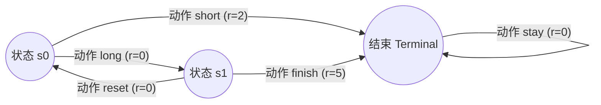
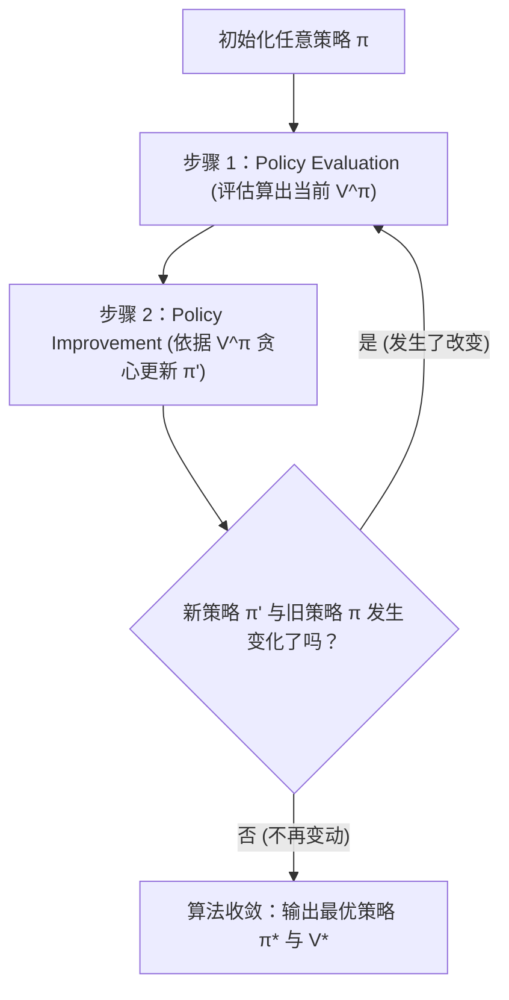

本文总结了基于动态规划（Dynamic Programming, DP）求解强化学习的核心算法。主要围绕四个关键概念展开：**策略评估** (Policy Evaluation)、**价值迭代** (Value Iteration) 与 **策略提升** (Policy Improvement)、**策略迭代** (Policy Iteration)。

这些内容将我们前面理解的 **Bellman 方程** 从纯粹的“公式理论”，推演到了可实际写代码运行的 **Tabular RL 算法**。

---

## 1. 核心目标：算法为了解决什么问题？

### 第 4 课：已知模型与策略，如何评估？
在环境模型已知的前提下：
- **如果策略是固定的**，我们想要计算“在这个策略下每个状态有多好”，对应算法是 **Policy Evaluation（策略评估）**。
- **如果不固定策略**，想要直接找出所有状态的最优价值，对应算法是 **Value Iteration（价值迭代）**。

### 第 5 课：如何让策略变好？
- 如果已经有了准确的状态价值估计，如何将当前策略修改得更完美？对应操作是 **Policy Improvement（策略改进）**。
- 将“评估”与“改进”结合起来反复循环直至收敛，对应的就是 **Policy Iteration（策略迭代）**。

---

## 2. 贯穿全文的“袖珍 MDP”案例

为了更直观地理解表格型 RL，我们定义了一个超迷你的马尔可夫决策过程 (MDP)：

- 状态集合: `s0`, `s1`, `terminal`
- 折扣因子: $\gamma = 0.9$

**交互机制图解**：

在这个转移下，可以明显看到核心直觉：
- 在 `s0` 时刻执行 `short`，眼前收益极好，能马上拿 `2`。
- 在 `s0` 时刻执行 `long`，眼前收益为 `0`，但它能带领我们进入金矿状态 `s1`（下一步能拿 `5`）。
- **短期最优不等于长期价值最优。** (长期预估: `short` = 2, `long` = 0 + $0.9 \times 5 = 4.5$)

---

## 3. Policy Evaluation (策略评估)

**核心思想**：策略被固定死，不比较动作，我们纯粹为了计算出在这一死板策略下，“每个状态的终局折现回报期望是多少”。

数学依据是 Bellman Expectation Equation（贝尔曼期望方程）：
$$ V^\pi(s) = \mathbb{E}[R_{t+1} + \gamma V^\pi(S_{t+1}) | S_t = s] $$

**代码验证实验**：
假设我们固定瞎走的策略为 `s0 -> long`, `s1 -> finish`, `terminal -> stay`。
- 第 1 次 Sweep 遍历后：`V(s0) = 0`, `V(s1) = 5.0`, `V(terminal) = 0`
- 第 2 次 Sweep 遍历后：`V(s0) = 4.5`, `V(s1) = 5.0`, `V(terminal) = 0`

**感悟**：`s1` 因为能直接拿到 `5`，立马变得有价值。而 `s0` 需要等待 `s1` 的价值传播过来（在第一次 Sweep 时 `s1` 的价值还没回传到位）。也就是，**价值信息是沿着状态转移流的方向，从后往前逐渐扩散（Backup）的。**

---

## 4. Value Iteration (价值迭代)

**核心思想**：不捆绑某个特定策略。既然目的是为了找全局最强，那我就在每次回传价值验证时，**强制性地**对该状态下的所有能走的分支取最大值。

数学依据是 Bellman Optimality Equation（贝尔曼最优方程）：
$$ V^*(s) = \max_a \mathbb{E}[R_{t+1} + \gamma V^*(S_{t+1}) | S_t = s, A_t = a] $$

**代码验证实验**：
- 第 1 次 Sweep：由于初期大家都是 0 星，`s0` 看不到更远的利益，所以短期贪心地选择了 `short` （获得价值 2）。此时 `V(s0) = 2.0`, `V(s1) = 5.0`。
- 第 2 次 Sweep：`s1` 的强大价值传播完毕。`s0` 现在发现了走 `long` 未来的隐性价值能达到 $4.5$，立刻改变了最优认知！此时 `V(s0) = 4.5`, `V(s1) = 5.0`。

**说明一点**：Value Iteration 并不是先知仙觉的一步到位，它也是在无尽的反复运算中，**用更久远的眼光一次次冲刷掉眼前的短视。**

---

## 5. Policy Improvement (策略提升)

**核心思想**：假设我现在已知了精确的状态地图 `V(s)`。我只需要在当前站在路口的状态下，看看我可选的那些动作，把每一个对应后果的**候选值**都算一遍：
$$ Candidate(a) = \mathbb{E}[R + \gamma V(s')] $$ 
选值最大的对应的那个动作（Greedy 更新）。

一句话解释：**Value 是底牌，告诉你“多好”；Policy Improvement 是根据底牌挑出无与伦比打法的决断。**

---

## 6. Policy Iteration (策略迭代)

**核心思想**：建立在“评估”与“提升”之上的无限闭环循环。

**实验跑出的精彩现象**：
假如初始策略愚蠢至极设置为了：`s0 -> short`, `s1 -> reset`。

- **Round 1 (评估)**：`V(s1)` 竟然只有 `1.8`（因为在瞎转圈，最后只能落到 `s0` 的短视奖励 `2.0 * 0.9 = 1.8`）。
- **Round 1 (改进)**：此时的价值反馈告诉我们 `s1` 走 `finish` 的 `5` 更靠谱。于是，**先是状态 `s1` 的策略被抢救了过来**。
- **Round 2 (评估)**：在 `s1 -> finish` 被修好后，`V(s1)` 顺利评估出正常价值 `5.0`。
- **Round 2 (改进)**：`V(s1)` 满血回归后，传递到源头的状态 `S0` 终于开眼看到了 `long` 这个动作的好。**进而，状态 `s0` 也被改了过来。**
- **Round 3**：一切不再变化，跳出循环，输出最优解。

这揭示了一个绝妙的哲学：**智能体宏观策略的修复，经常是从环境有确定奖励反馈的终端发源，反向朝着起点逐渐“传染修复”的。** 这又是价值转移最充分的证明。

---

## 7. 概念图解大对比

| 算法 / 概念 | 动作比较机制 | 能否算做最终“学透”环境？ | 核心依据公式 |
| :--- | :--- | :--- | :--- |
| **Policy Evaluation** | 固定死动作，不比对 | 不能。仅为算出已知死板策略下的价值 | Bellman Expectation |
| **Value Iteration** | 直接取 `max` 更新 | 独立算法！单刀直入求解最高得分上限。 | Bellman Optimality |
| **Policy Improvement** | 枚举每个合法走向，取极大值做一次提升 | 不能。只是在已知底标价下挑选买方。 | 局部期望对比 |
| **Policy Iteration** | Evaluation $\leftrightarrow$ Improvement 轮转交替 | 独立算法！交替互搏直到稳态收敛。 | 上述两种概念的轮换 |

---

## 8. 下一步路在何方

到目前阶段，您已经完全吃透了 **Tabular 强化学习的第一条主干道**：具备明确环境模型支持下可以全局俯瞰计算的动态规划（Dynamic Programming）。
这是一个本质的跨越：您不再单纯局限在 RL 的名词里，您真切地明白了“**价值怎么定义、怎么后向传递更新，策略该怎么迭代进化**”。

之后的路径（也就是下一步的突破口），将会彻底抛弃“开卷考”的情况：
我们不再预先知晓上帝视角的**转移概率模型 $P$**，所有的一切全凭 Agent 的肉身去无知探索闯荡。
- **Monte Carlo (蒙特卡洛法 MC)**
- **Temporal Difference (时序差分法 TD-learning)**
