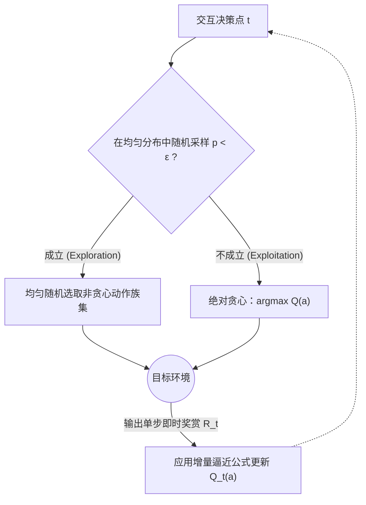
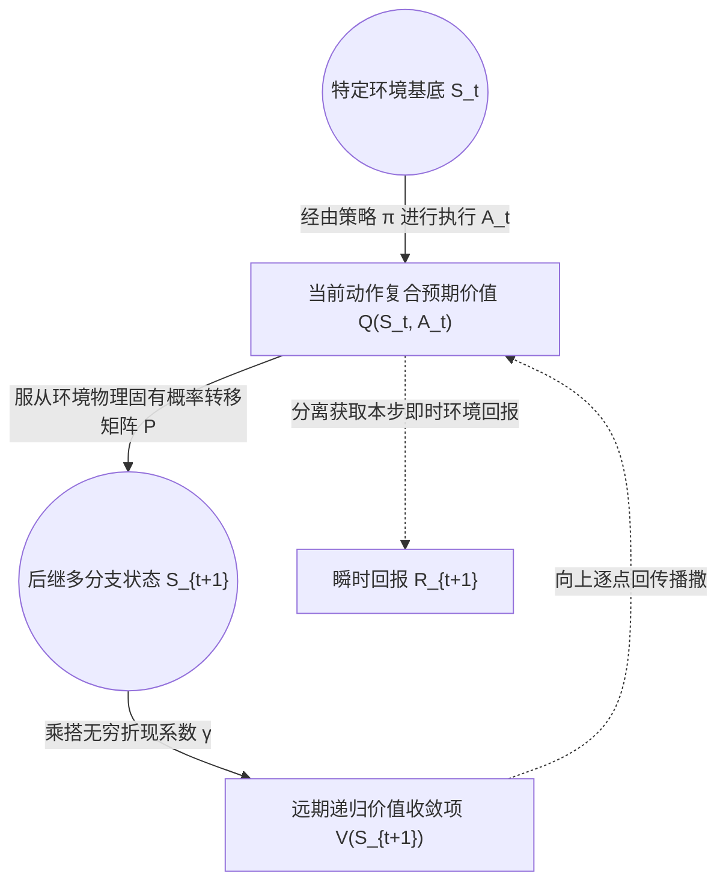

本文是对强化学习（Reinforcement Learning, RL）理论基石的基础性总结，旨在以严谨的学术视角剖析多臂老虎机模型（Multi-Armed Bandit, MAB）、探索与利用困境（Exploration vs Exploitation Dilemma）、乃至马尔可夫决策过程（Markov Decision Process, MDP）与贝尔曼递归方程（Bellman Equation）的内在数学逻辑。

## 1. 理论起点：多臂老虎机模型 (MAB)

### 1.1 问题定义
`Multi-armed Bandit`（多臂老虎机）是剥离了环境状态转移机制的极简决策模型。在系统设定中，存在 $K$ 个可选的独立动作集合，每次执行任一动作 $a_t$ 后，环境将基于其幕后的潜在真实概率分布输出收益度量（Reward, $R_t$）。

相较于具备完整时间步延展的强化学习架构，Bandit 模型略去了**状态的马尔可夫演变**与**信用分配**的复杂性，直面机器学习智能体最初始的核心矛盾：**探索与利用困境 (Exploration vs Exploitation)**。

### 1.2 Exploration vs Exploitation 构建
- **Exploitation（利用）**：即基于经验预估贪心行事，选择在历史统计表现中最优的期望策略方案。优点是保障当前收益下限，缺点是极易使系统收敛并永久困顿于次优解。
- **Exploration（探索）**：投入当前行动力去尝试不具统计优势，甚至未知领域的策略方案。目的在于矫正分布偏差并挖掘潜在更优的长期解。

---

## 2. 基线算法：Epsilon-Greedy 探索策略

为定量平衡上述困境，业界引入 $\epsilon$-greedy（Epsilon 贪婪算法）作为基准对比。

### 2.1 决策逻辑
算法采用刚性的概率指派法：

### 2.2 增量更新公式解析
基于大数定理的滑动平均可由如下差分形式计算动作价值分布 $Q_n(a)$：
$$ Q_n = Q_{n-1} + \frac{1}{n} [R_n - Q_{n-1}] $$
> **数学意义阐述**：此处 $R_n - Q_{n-1}$ 即为**时序差分误差（TD Error）的雏形**。通过将新观测的奖励 $R_n$ 与过往经验锚点预估值作差，得到反馈修正梯度。常数系数 $1/n$ 充当学习率，保障迭代计算序列的收敛性要求。

---

## 3. 进阶算法：UCB 不确定性边界驱动

### 3.1 核心理论与 Optimism in the Face of Uncertainty
$\epsilon$-greedy 的随机策略充斥着全局盲目性，为解决该问题，置信上限（Upper Confidence Bound, UCB）算法基于**“面对未知保持乐观”**的思想进行重构。通过数理统计的方法，为样本量短缺的选项赋予可观的探索溢价（Exploration Premium）。

### 3.2 公式拆解与霍夫丁边界
UCB 在单步动作筛选函数定义如下：
$$ A_t = \arg\max_a \left[ Q_t(a) + c \sqrt{\frac{\ln t}{N_t(a)}} \right] $$

**各项底层作用机制详解**：
1. **经验均值项 $Q_t(a)$**：充当**利用 (Exploitation)** 核心指标，代表统计期望下界。
2. **探索补偿项 $c \sqrt{\dots}$**：是由霍夫丁独立不等式（Hoeffding's Inequality）推导收缩出的高置信探索边界指标。
   - **分母 $N_t(a)$**：对动作进行的样本收集越丰富，此项越膨胀拉低补偿，加速收敛并减少盲测浪费资源。
   - **分子 $\ln t$**：随时间全局推进，对数增长平缓拉升那些早已被冷落的选项，避免动作被永久饿死截断。
   - **常数超调 $c$**：系统整体不确定性接受度系数。

**在学术上的理论意义**：UCB 可以被数学论证出拥有在时间序列极长尺度下，受限于严苛的低阶对数复杂度 $O(\ln t)$ 渐近懊悔值（Regret）上限。这意味着它能够被认定为极其逼近全局最优决策界限的算法手段。

---

## 4. 体系演变：马尔可夫决策过程 (MDP)

仅研究静态 Bandit 在于理解决策矛盾机制，真正智能体面临的复杂连续统往往牵扯动态关联系统。由此，需正式引入马尔可夫架构（MDP）。

### 4.1 MDP 动力转移图论
MDP 体系结构可由如下经典的智能体-环境互动流形描绘：

### 4.2 MDP 五大基石构件
- **State ($\mathcal{S}$)**：全部系统状态的度量空间。
- **Action ($\mathcal{A}$)**：合法操控输入的向量维度。
- **Transition Probability ($\mathcal{P}$)**：内建马尔可夫随机矩阵，映射 $\mathbb{P}[S_{t+1}|S_t, A_t]$ 概率转移。
- **Reward ($\mathcal{R}$)**：表征特定切片状态质量的即时奖励定义。
- **Discount Factor ($\gamma$)**：未来折现率常数 $\gamma \in [0,1]$，用于惩罚久远收益从而促成级数函数收敛。

### 4.3 终局目标定义: Return
Return 的数学级数累加即代表长期效用的绝对指标：
$$ G_t = R_{t+1} + \gamma R_{t+2} + \gamma^2 R_{t+3} + ... = \sum_{k=0}^{\infty} \gamma^k R_{t+k+1} $$

---

## 5. 算法核心引擎：Bellman 递归方程

Bellman 递推证明了当前瞬时价值，恰等于单步即时期望辅以折现的后续价值之和。这一方程为后续价值迭代建立了不灭根基。

**Bellman Expectation Equation (贝尔曼期望评估方程)**：
$$ V^\pi(s) = \mathbb{E}_\pi [R_{t+1} + \gamma V^\pi(S_{t+1}) | S_t = s] $$
**Bellman Optimality Equation (贝尔曼最优寻根方程)**：
$$ V^*(s) = \max_{a \in \mathcal{A}} \mathbb{E} [R_{t+1} + \gamma V^*(S_{t+1}) | S_t = s, A_t = a] $$

---

## 6. 学术总结与下一步延展

经过上述理论剥丝抽茧，我们已明确掌握了从最初的静态博弈（Bandit模型内的 $\epsilon$-greedy 与 UCB 无偏置搜索方法），逐步建立起了面向动态世界的 MDP 马尔可夫模型矩阵，并最终抽象出能够增量后反向回传价值影响力的递归范式：Bellman 方程。

沿着此理论基石向上仰望，下一步的发展即直接衍生出能够依靠编程实现解构寻优的 **Tabular RL（表格型动态规划方法）算法族列**：
- **Policy Evaluation** $\rightarrow$ **Policy Improvement** $\rightarrow$ **Policy/Value Iteration**
从公式纸面推演，正式走向大规模矩阵迭代寻解方案的工程构建之战。
