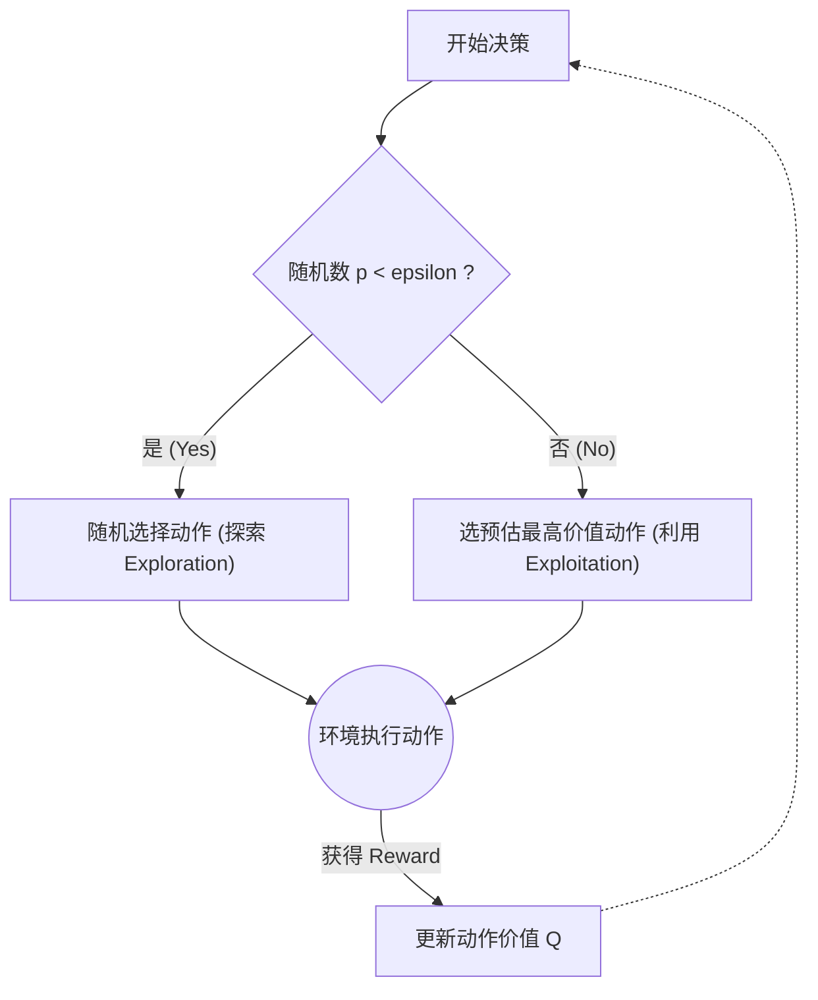
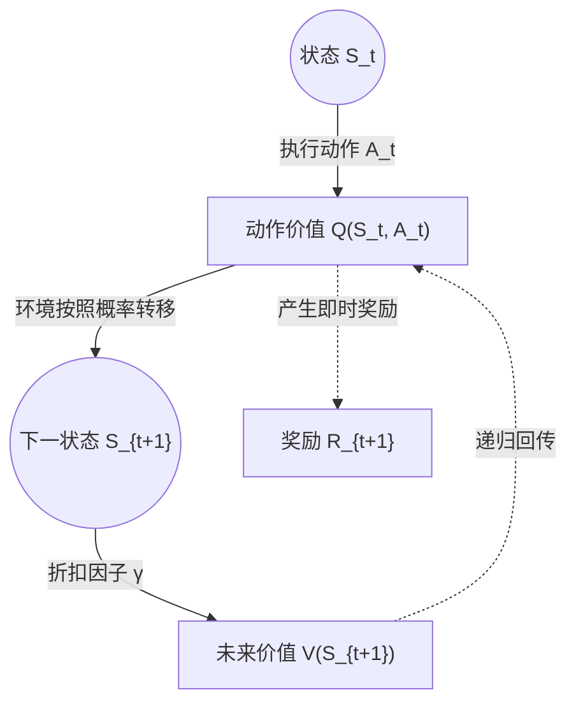

本文总结了强化学习（Reinforcement Learning, RL）入门阶段的核心概念，重点梳理了多臂老虎机（Multi-armed Bandit）、置信上限（UCB）算法以及马尔可夫决策过程（MDP）和贝尔曼方程（Bellman Equation）的基础知识。

## 1. 核心学习脉络

本次学习主要围绕以下三个部分展开：
- **Bandit 问题** 与 `Exploration vs Exploitation`（探索与利用）的权衡。
- **UCB（Upper Confidence Bound）** 算法：“更聪明的探索”策略。
- **MDP 框架**、`Return`（回报）、`Value`（价值）与 **Bellman Backup**。

---

## 2. Bandit 与 epsilon-greedy 策略

### 2.1 什么是 Multi-armed Bandit？
`Multi-armed Bandit`（多臂老虎机）是最简单的决策学习问题，它包含多个可选动作，每次选择一个动作后环境会返回一个随机奖励。目标是最大化长期平均奖励。

相比于完整的 RL 框架，Bandit 没有**状态转移**、**长期信用分配 (Credit Assignment)** 和**价值函数的复杂递归**。但它引入了 RL 最核心的困境：**Exploration vs Exploitation**。

### 2.2 Exploration vs Exploitation
- **Exploitation（利用）**：优先选择当前已知最优的动作。
- **Exploration（探索）**：尝试其他动作，寻找潜在的更优解。

只利用不探索，容易陷入局部最优（过早陷入错误选择）；只探索不利用，则长期奖励低下。

### 2.3 epsilon-greedy 策略
为了平衡探索与利用，采用 `epsilon-greedy` 策略：

- 以概率 `epsilon` 随机探索。
- 以概率 `1 - epsilon` 选择当前估计值最大的动作。

动作价值的更新公式（增量式样本平均）：

$$
Q_n = Q_{n-1} + \frac{1}{n} * (R_n - Q_{n-1})
$$

> **直觉理解**：新估计值 = 旧估计值 + 修正项（即误差带来的反馈）。高于预期则向上修正，低于预期则向下修正。

### 2.4 实验结论
通过对不同 `epsilon` 值的实验结果对比：
- `epsilon = 0.0`（全贪心）容易过早陷入次优选择。
- `epsilon = 0.1` 表现较均衡，少量探索足以发现最优动作。
- `epsilon = 0.3` 探索过度，虽然能发现最优动作，但在次优动作上耗费了更多步数。

---

## 3. UCB 算法：不确定性驱动的探索

### 3.1 从 epsilon-greedy 到 UCB
`epsilon-greedy` 的探索是盲目的（纯随机）。UCB（Upper Confidence Bound）的核心思想是建立在**不确定性**上的：

$$
Score(a) = Estimated\_Value(a) + Exploration\_Bonus(a)
$$

即不仅关注动作当前的预估价值，还关注该动作尚未被充分了解的程度。

### 3.2 UCB 更新公式
常见形式：

$$
UCB(a) = Q(a) + c \sqrt{\frac{\ln(t)}{N(a)}}
$$

- `Q(a)`：当前估计值
- `t`：当前总步数
- `N(a)`：动作 `a` 被选择的次数
- `c`：探索强度调节参数

> **直觉理解**：`N(a)` 越小，说明对该动作的信心越低，相应的探索奖励（Bonus）越大，从而鼓励尝试。随着不断尝试，Bonus 递减。

### 3.3 实验结论
- UCB 相比 `epsilon-greedy` 更具策略性，其探索更集中于未被充分尝试的动作。
- 参数 `c` 越小越偏向利用，越大越偏向探索。但单次随机种子的结果具有偶然性，不能仅凭一次实验武断认定超参数的绝对优劣。

---

## 4. MDP 框架与 Bellman 方程

### 4.1 引入 MDP
真正的 RL 面临的问题不仅仅是“动作与奖励”，还需要考虑**状态 (State)**的流转：当前动作会将环境带入什么样的新状态，又会如何影响未来的收益？
为此，需要引入马尔可夫决策过程（MDP）。它的核心智能体-环境交互循环如下：

### 4.2 MDP 的核心五元组
- `S` (State)：状态集合
- `A` (Action)：动作集合
- `P` (Transition Probability)：状态转移概率
- `R` (Reward)：奖励函数
- `gamma` (Discount Factor)：折扣因子

### 4.3 Return 与 Value
- **Return (G_t)**：未来折扣奖励总和。
  
  $$
  G_t = R_{t+1} + \gamma R_{t+2} + \gamma^2 R_{t+3} + ...
  $$
  
  体现了 RL 关注长期总收益的核心诉求（`gamma` 越接近 1 则越看重长期收益）。

- **状态价值 (State Value, V)**：$V^\pi(s)$ 表示在策略 $\pi$ 下，从状态 $s$ 出发未来的期望回报。
- **动作价值 (Action Value, Q)**：$Q^\pi(s, a)$ 表示在状态 $s$ 执行动作 $a$ 后，遵循策略 $\pi$ 的期望回报。

  > **简单区分**：`V` 衡量“在这个状态有多好”，而 `Q` 衡量“在这个状态下做这个动作有多好”。

### 4.4 Bellman 方程核心思想
Bellman 方程是价值函数的递归关系。其核心直觉：
**当前价值 = 当前奖励 + 折扣后的未来价值**

通过状态转移树（Bellman Backup Tree）可以直观地看到这种“后向回传”：

- **Bellman Expectation Equation（期望方程）**：
  $$ V^\pi(s) = \mathbb{E}[R_{t+1} + \gamma V^\pi(S_{t+1}) | S_t = s] $$
- **Bellman Optimality Equation（最优方程）**：
  $$ V^*(s) = \max_a \mathbb{E}[R_{t+1} + \gamma V^*(S_{t+1}) | S_t = s, A_t = a] $$

Bellman Update 是 RL 算法中能够进行增量计算和向后传递信息的理论基石。

---

## 5. 常见易混淆点澄清
1. **Reward** 是单步即时奖励，**Return** 是累积的回报。
2. **Return** 是一次特定轨迹的累积值，**Value** 是期望的 Return。
3. **V(s)** 只和状态相关，**Q(s, a)** 与动作直接相关。
4. **Bellman backup** 不是直接计算整个 Return，而是做“一步的递归更新”。
5. 单次实验“表现最好”的超参数，并不等于统计意义上的“全局最优”。

---

## 6. 下一步方向
通过代码实现 Bandit 与 Bellman backup，目前已建立了基本的 RL 探索与利用的思维，并理解了价值函数的递归。
接下来的核心内容将进入 Tabular RL 主线：
- Policy Evaluation（策略评估）
- Policy Improvement（策略提升）
- Policy Iteration（策略迭代）
- Value Iteration（价值迭代）

准备好让 MDP 与 Bellman Equation 真正转化为可求解的智能体算法。
