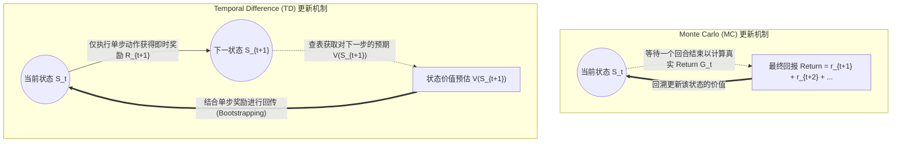
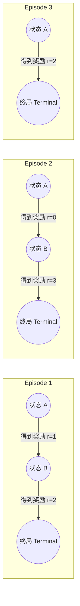

本文是对强化学习中**无模型预测（Model-Free Prediction）**核心算法的学习总结。在此阶段，我们从“已知环境模型”（Dynamic Programming, 动态规划）的假设，正式过渡到“**通过与环境直接交互进行采样**”以学习状态价值的阶段。

本讲主要对比分析两大核心算法：
- **Monte Carlo (蒙特卡洛法, MC)**
- **Temporal Difference (时序差分法, TD(0))**

---

## 1. 算法背景：为何引入无模型（Model-Free）方法

在策略迭代、价值迭代等 DP 算法中，存在一个关键的前提假设：**要求完整的环境模型（Transition Probability & Reward Function）是已知的**。即智能体了解状态转移矩阵和所有具体的奖励设定。

然而在大部分复杂的真实业务场景中（如机器人控制、自动驾驶系统），环境通常呈现**高度复杂且未知的黑盒状态**。
在此情境下，智能体只能：
1. 与未知环境直接交互，收集真实的观测轨迹（Episode）。
2. 根据这些收集到的经验（Experience），逐步评估与学习各个状态的长期价值。

**MC** 和 **TD** 正是用于解决此类无模型评估问题的核心方法。

---

## 2. 核心算法思想对比如下

- **`MC` (Monte Carlo)**：**基于完整序列的回报计算**。MC 算法在整个交互回合（Episode）结束后，直接计算获取的真实累积回报（Return），并用此真实回报来更新轨迹上经历过的状态价值。
- **`TD` (Temporal Difference)**：**基于单步交互的自举更新**。TD 算法不需要等待回合完全结束，它在每执行一步、获得单步奖励后，结合对**下一状态现有的价值估计**来更新当前状态的价值（此机制被称为 **Bootstrapping**, 自举法）。

以下流程图清晰展示了两者的更新机制差异：

---

## 3. 推演数据集：情境设定

为分析算法具体执行过程，构建以下包含 3 条完整轨迹（Episode）的微型数据集。
（参数设定：衰减因子 $\gamma = 1.0$，学习率 $\alpha = 0.5$；初始所有状态估计价值设定：`V(A)=0`, `V(B)=0`）。

---

## 4. Monte Carlo (MC) 数值推演

`Monte Carlo` 不利用其他状态的估计值，其核心使用真实的回报公式：
$G = r_1 + \gamma r_2 + \gamma^2 r_3 + ...$
由于 $\gamma = 1.0$，此处直接计算标量累加和。

采用 **First-visit MC** 评估策略：在每一条轨迹中，仅对某状态**首次出现**的位置计算后续整体回报（Return），并在所有轨迹上求平均值。

**对状态 A 的推演：**
- Ep1 中，`A` 后续获得的奖励是 1, 2。故 $G(A) = 1 + 2 = 3$ 
- Ep2 中，`A` 后续获得的奖励是 0, 3。故 $G(A) = 0 + 3 = 3$
- Ep3 中，`A` 后续获得的奖励是 2。故 $G(A) = 2$
- 均值结算：`V(A) = (3 + 3 + 2) / 3 = 2.6667`

**对状态 B 的推演：**
- Ep1 中 $G(B) = 2$
- Ep2 中 $G(B) = 3$
- Ep3 中无状态 B，不纳入计算。
- 均值结算：`V(B) = (2 + 3) / 2 = 2.5`

**MC 的输出结果：`{'A': 2.667, 'B': 2.5}`。此为基于全局实际发生事实累加计算的最优无偏估计均值。**

---

## 5. TD(0) 数值推演

TD(0) 的核心是 **Bootstrapping（自举法）**，即使用现有的数值估计去修正过去的参数。其更新法则为：
$$ V(s) \leftarrow V(s) + \alpha \times [R + \gamma V(s') - V(s)] $$

> **公式批注**：方括号内的 $R + \gamma V(s')$ 称为 **TD Target**（TD目标），代表单步反馈与下一状态预估的总和；减号后的总括部分则称为 **TD Error**（时序差分误差），等效于用最新获得的信息修正原有预期。

以 $\alpha = 0.5$ 在上述轨迹中进行逐步推演：

**【处理 Ep1】**
1. 观察步进 `A --(r=1)--> B`：
   目标基准为 $1 + V(B) = 1 + 0 = 1$
   $V(A)$ 更新：$0 + 0.5 \times (1 - 0) = 0.5$
2. 观察步进 `B --(r=2)--> terminal`：
   目标基准为 $2 + V(terminal) = 2 + 0 = 2$
   $V(B)$ 更新：$0 + 0.5 \times (2 - 0) = 1.0$

**本轮回合后状态：`V(A)=0.5, V(B)=1.0`**

**【处理 Ep2】（状态值继承并继续演进）**
1. 观察步进 `A --(r=0)--> B`：
   目标基准调用刚刚更新的 $V(B)$：$0 + 1.0 = 1.0$
   $V(A)$ 更新：$0.5 + 0.5 \times (1.0 - 0.5) = 0.75$
2. 观察步进 `B --(r=3)--> terminal`：
   目标基准为 $3 + 0 = 3$
   $V(B)$ 更新：$1.0 + 0.5 \times (3 - 1.0) = 2.0$

**本轮回合后状态：`V(A)=0.75, V(B)=2.0`**

**【处理 Ep3】**
1. 观察步进 `A --(r=2)--> terminal`：
   目标基准为 $2 + 0 = 2$
   $V(A)$ 更新：$0.75 + 0.5 \times (2 - 0.75) = 1.375$

**TD 本轮推导最终结果：`{'A': 1.375, 'B': 2.0}`。**

---

## 6. 算法评估：为何 MC 与 TD 的结果存在差异

尽管 MC 与 TD 处理的是相同的数据源，两者计算结果的巨大差异根源在于：**两者处理与利用数据样本的基础假设不同**。

- **MC 算法具有无偏性与高方差：** 它仅计算整条轨迹走完后的长期真实结果。由于其未利用状态之间的关联，结果保持无偏的客观性；但也因为单次随机轨迹往往具有较高方差，收敛通常较慢。
- **TD 算法大幅依赖现有预估计，具备低方差与一定偏差特性：** 由于初始预估值为 `0`、并且衰减率较小，使得早期的 TD 更新呈现较低的绝对数值。但 TD 运用了系统底层隐含的**马尔可夫属性**（即现在与未来有极强逻辑关联性，在推演时 `A` 有效引用了 `B` 的价值）。在长时间的渐进收敛过程中，TD 可以更高效地在线学习。

### 优缺点全景对比如下

| 算法特性 | Monte Carlo (MC) | Temporal Difference (TD0) |
| :--- | :--- | :--- |
| **更新层级** | 基于 Episode：须等待序列到达终端方可结算 | 联机/步进级 (Online)：每走一步立刻结算更新 |
| **Bootstrapping (自举应用)** | ❌ 纯样本采集，使用完整回报 (Total Return) | ✅ 引入自举，以预期价值更新当前预期价值 |
| **估计特性 (方差与偏差)** | 无偏差 (Unbiased)，高方差 | 存在部分偏差 (Biased)，稳定状态下方差较低 |
| **适用环境** | 仅能在限定长度的终局任务中应用 (Episodic) | 可支持无限长以及连续运行的观测任务 (Continuous) |

---

## 7. 易混淆概念与结论梳理

在进一步学习之前，需要理清以下几点逻辑理论概念：

1. **MC 算法并未舍弃对未知的预测**，其未使用 Bootstrapping 的核心原因在于它的每次观测项 $G_t$ 已包含序列结束端点的所有真实奖励反馈。
2. **TD 的本质等同于以单点采样替代的 Bellman 期望方程 (Bellman Backup)**。经典动态规划（DP）通过完整的环境状态转移概率矩阵 $P$ 对未来进行全局全景扫描与期望计算；而由于 TD 构建于对转移模型未知的体系上，其选择使用现实交互发出的那一次采样（Simulation）来替代全局概率期望计算。

综上所述，引入 MC 与 TD 的技术理论意义是使得强化学习脱出先知数学模型（Model-based）的限制，能在全黑盒场景中实现自适应性状态价值预判。

---

## 8. 下阶段预告：控制 (Control) 部分的引入

不论是 MC 还是 TD(0)，本质上我们所研究并求解的仍是对于**状态的绝对价值 $V(s)$的预估（Prediction 问题）**。要在黑盒环境里构建拥有强大博弈与决策能力的自治系统，不可避免地须对特定的**状态-动作组合价值 $Q(s,a)$** 进行精准掌握。

由价值评估（Prediction）迈向行为干预控制（Control），后续课程将引出该模块基于表格模型的两大经典控制算法：
- **SARSA (On-policy，同策略控制)**
- **Q-Learning (Off-policy，异策略控制)**
