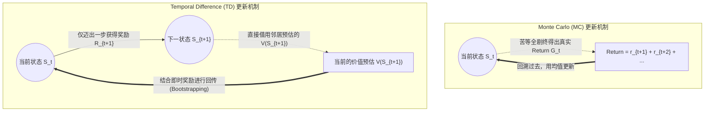
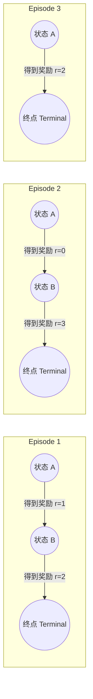

本文是对强化学习中**无模型预测（Model-Free Prediction）**核心算法的学习总结。我们将正式从“已知整体环境规则做规划”（Dynamic Programming）的温室，迈入“**通过采样经验学习价值**”的残酷真实世界。

核心比较算法为：
- **Monte Carlo (蒙特卡洛法, MC)**
- **Temporal Difference (时序差分法, TD(0))**

---

## 1. 为什么需要 MC 和 TD？痛点在哪？

在前面的学习中（如策略迭代、价值迭代等 DP 方法），有一个共同的前提：**必须预先已知环境模型（Transition & Reward Model）**。也就是说，智能体处于上帝视角，明确知道“如果在状态 S 做动作 A，有几成概率去到 S'，并且一定会获得多少奖励”。

但在真实的业务场景（如自动驾驶、玩游戏、机器人控制）中，**环境往往是个完全未知的黑盒**。
此时，我们就只能让智能体**“肉身下场试错”**：
1. 和未知环境不断交互，收集一条条真实的“采样轨迹（Episode）”。
2. 基于这些亲身经历过的经验，去倒推和学习各个状态的价值。

这类抛弃完备模型依赖的新型算法的大门，便由 **MC** 和 **TD** 率先敲响。

---

## 2. 核心思想：一句话道破天机

如果这节课只能记住一句话，请牢记：

- **`MC` (Monte Carlo)**：**“不撞南墙不回头”**。必须等完整的一局游戏（Episode）彻底打完，拿到确切的总得分真实 Return，再用总结果去复盘更新每个沿途状态的评价。
- **`TD` (Temporal Difference)**：**“走一步看一步”**。每前进一步拿到即时奖励，不等剧终，就直接结合下一步的“当前预估价值”进行拼凑更新计算（这被称为 **Bootstrapping**，即自举拉扯现象）。

以下图解可以最直观地体现这两者的底层差异：

---

## 3. 推演数据集：极简轨迹（Episode）

为了手动拆解算法，我们构建了以下含有 3 条轨迹的数据集（参数设定：不衰减设定 $\gamma = 1.0$，单步学习率 $\alpha = 0.5$）。

初始猜测状态价值设定：`V(A)=0`, `V(B)=0`, `V(terminal)=0`。

---

## 4. Monte Carlo (MC) 纯手工推演

`Monte Carlo` 不猜测中间结果，用的是实打实的回报：
$G = r_1 + \gamma r_2 + \gamma^2 r_3 + ...$
由于 $\gamma = 1.0$，所以就是简单的标量累加和。

我们采用 **First-visit MC** 评估策略：在每一条轨迹中，仅对某状态**第一眼出现**的位置计算后续整体 Return，最后求均值。

**对 A 的推演：**
- Ep1 中，`A` 往后获得的奖励是 1, 2。所以 $G(A) = 1 + 2 = 3$ 
- Ep2 中，`A` 往后获得的奖励是 0, 3。所以 $G(A) = 0 + 3 = 3$
- Ep3 中，`A` 往后获得的奖励是 2。所以 $G(A) = 2$
- 平均真实价值：`V(A) = (3 + 3 + 2) / 3 = 2.6667`

**对 B 的推演：**
- Ep1 中 $G(B) = 2$
- Ep2 中 $G(B) = 3$
- Ep3 中无状态 B，直接无视忽略。
- 平均真实价值：`V(B) = (2 + 3) / 2 = 2.5`

**MC 结果：`{'A': 2.667, 'B': 2.5}`。这是用上帝视角的全部完场赛果汇报汇总出来的硬指标。**

---

## 5. TD(0) 纯手工推演

TD(0) 的精髓是 **Bootstrapping（拔靴法/自举）**，更新法则公式为：
$$ V(s) \leftarrow V(s) + \alpha \times [R + \gamma V(s') - V(s)] $$

> 公式解读：方括号里 $R + \gamma V(s')$ 就是 **TD Target**（TD目标），它是当下这“一小步结合未来幻想”给出的最新基准；而减号后的部分被称为 **TD Error**（时序差分误差）。它等同于用“你借用未来的经验估计出的新认知”去猛烈修正“你原本旧有的认知”。

我们以 $\alpha = 0.5$ 跟着轨迹逐步推盘走完：

**【处理 Ep1】**
1. 观察到步进 `A --(r=1)--> B`：
   目标基准为 $1 + V(B) = 1 + 0 = 1$
   $V(A)$ 更新修正：$0 + 0.5 \times (1 - 0) = 0.5$
2. 观察到步进 `B --(r=2)--> terminal`：
   目标基准为 $2 + V(terminal) = 2 + 0 = 2$
   $V(B)$ 更新修正：$0 + 0.5 \times (2 - 0) = 1.0$

**此时底注更新：`V(A)=0.5, V(B)=1.0`**

**【处理 Ep2】（带着 Ep1 滚雪球的更新遗产继续）**
1. 观察到步进 `A --(r=0)--> B`：
   ⚠️ 注意：这里目标基准使用了刚刚更正过的 $V(B)$ -> $0 + 1.0 = 1.0$
   $V(A)$ 继续更新：$0.5 + 0.5 \times (1.0 - 0.5) = 0.75$
2. 观察到步进 `B --(r=3)--> terminal`：
   目标基准为 $3 + V(terminal) = 3 + 0 = 3$
   $V(B)$ 继续更新：$1.0 + 0.5 \times (3 - 1.0) = 2.0$

**此时底注更新：`V(A)=0.75, V(B)=2.0`**

**【处理 Ep3】**
1. 观察到步进 `A --(r=2)--> terminal`：
   目标基准为 $2 + 0 = 2$
   $V(A)$ 开始结尾更新：$0.75 + 0.5 \times (2 - 0.75) = 1.375$

**TD 最终本轮收敛结果：`{'A': 1.375, 'B': 2.0}`。**

---

## 6. 核心认知：为什么 MC 和 TD 算出来的结果悬殊？

这是本节课最精妙绝伦的点。两者结果天差地别，**绝对不是因为谁算得不准**，而是因为两者**榨取数据内涵的方式**不在一个频道：

- **MC 绝对忠于每一次孤立的历史事件：** 它计算的是整个局打完时的平均账本。结果没有累积继承效应，方差大但是结果绝对直观（毫无偏见，仅用事实说话）。
- **TD 大幅拥抱了试探猜测，学得极具连贯推导性：** 因为我们的 `alpha=0.5` 衰减且步数太少，起步的 `0` 将价值狠狠拉低了。但 TD 利用了马尔可夫属性（环境在过去和未来有关联性），在**物理空间紧密的状态间建立了非常强的连线关系**（我们在上方推演时更新 A 的同时直接就借用了 B 的最新估计）。只消给它无尽的循环数据洗礼，它自身逻辑中修正偏差的能力会使其无限靠拢并逼近环境真实价值！

### 优缺点全景大比武

| 特性维度 | Monte Carlo (MC) | Temporal Difference (TD0) |
| :--- | :--- | :--- |
| **更新频率与实效时机** | 漫长。必须等待一局结束（Episode终结） | 极快。每探走一步当即结算更新 (Online Learning) |
| **Bootstrapping (利用自举)** | ❌ 拒绝画饼和猜忌，只看尘埃落定的真实 Return | ✅ 借用下一状态现成的估值作为推拉力以辅助更新 |
| **计算方差与估值偏差** | 零偏差，但每次轨迹变数大导致高方差 (颠簸剧烈) | 具有初始化偏差假象，但拥有极稳定可靠的低方差 |
| **环境兼容性限制** | 必须属于会抵达终点（Terminal）结束的闯关任务 | 完全适用于死循环永不休止（Continuous）的监控任务 |

---

## 7. 避坑指南梳理

在初学推导时，很容易掉入似是而非的概念泥沼，谨记：

1. **MC 没有抛弃状态预测：** 它并不利用 $V(S_{next})$ 协助的原因是没必要。它攥在手里的 $G_t$ 已经是当前点一直抵达剧终收割到的“最终奥义汇总”，这不比半路预估好用得多？
2. **TD 高度类似于 DP 章节的 Bellman Backup（状态空间回溯）：** DP 算法用期望和状态完美转移概率 $P$ 的数学期望来死磕算完所有可能；而 TD 则是身处黑暗中拿不到概率映射模型，就索性顺坡下驴，沿着它随机经历的那一次采样来充当单步的类“Bellman 一步采样学习”。（这种在未知状态下也能高效滚雪球的方式为之后自动驾驶的大模型落地打下了纯物理学底座）。

### 一句话灵魂归结
此时你的认知维度，终于剥去了概率计算的模型枷锁，彻底明悟了：**只要你扔我进环境里受难跌打摸爬，哪怕你不告诉我这是什么世界的运转规则，通过 MC 或者 TD 这套精巧的价值汲取引擎，俺都能完美倒推出各个节点它究竟值几个钱！**

---

## 8. 下一站神秘剧透

不论是稳扎稳打的 MC 还是步步为营的 TD，整节总结我们在折腾评估的还仅仅是**状态的终极含金量 $V(s)$**。要想拥有真正智能和强大的动作博弈能力，“处在这个状态下到底选什么动作才能大获全胜全盘通杀”始终是控制最关键的话题。
从单纯预测 $V(s)$ 走向强行主导干预万物的价值 $Q(s,a)$，下一节课等待我们的将是真正的表格类强化控制之王：
- **SARSA (On-policy，策略固化更新)**
- **Q-Learning (Off-policy，异策略大胆尝试)**
