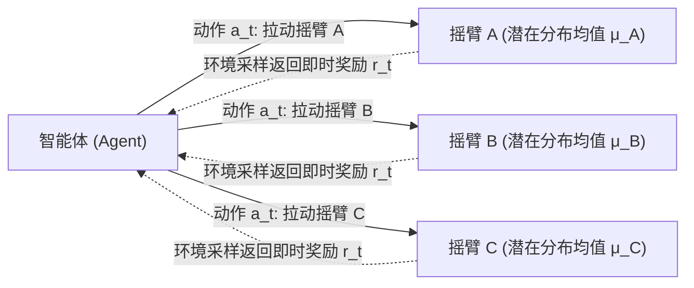
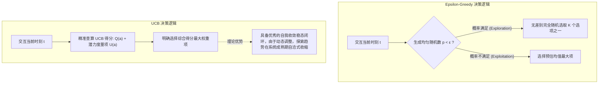

本文探讨强化学习（Reinforcement Learning）中最核心且最具基础性的命题——**多臂老虎机问题（Multi-Armed Bandit, MAB）**。
该问题抽离了复杂的状态转移（State Transitions）机制，直击机器学习领域中一项独有的决策博弈：**探索与利用的困境（Exploration vs Exploitation Dilemma）**。

这是我们在构建起基础工程编程工具之后，正式步入经典强化学习算法理论框架的第一阶梯。

---

## 1. 理论背景：什么是多臂老虎机模型？

在开始研究需要基于序列规划的马尔可夫决策过程（MDP）之前，我们首先研究一个无状态的极致简化模型：**Multi-Armed Bandit (MAB)**。

设定如下：
- 环境提供 $K$ 个动作可选（类比有 $K$ 个控制杆的赌场老虎机）。
- 每次选择一个特定的动作后，环境会从一个**未知的固有概率分布**中抽样并返回数值奖励（Reward）。
- 智能体的最高决策目标：**在有限的交互步数内，最大化累积获得的总奖励。**

这种模型完美模拟了没有任何先验知识下，智能体如何通过主动采样与环境交互的底层逻辑。

---

## 2. 核心命题：探索与利用的博弈

基于信息学的第一性原理，智能体在评估事物时的原始信息仅源自其有限的历史经验。面对未知环境，每一次动作选择均面临着根本性冲突：

- **利用（Exploitation）**：选择历史统计中平均预期收益最高的选项，以获取眼前稳妥且可观的收益。
- **探索（Exploration）**：选择历史中尚未充分评估、或者不常触及的选项，旨在寻找具有更高潜在收益的新选择。

如果算法仅考虑**利用**，极易快速深陷且永久停滞于次优的局部最优解中。
如果算法过度**探索**，则会导致大量时间与计算资源被白白浪费在此前已验证的劣质选项上。

---

## 3. 基线算法：Epsilon-Greedy 策略

为了实现二者的硬性平衡，业内引入了最经典的启发式基线策略——$\epsilon$-greedy（Epsilon 贪婪算法）。

### 3.1 核心定义
其通过显式的概率超参数 $\epsilon$ 强行分配资源：
- 赋予 **$1 - \epsilon$** 的绝大概率进行纯粹的开发（Exploitation）：选择当前预估均值 $Q(a)$ 最大的动作。
- 赋予 **$\epsilon$** 的微弱概率进行探索（Exploration）：在所有可用选项中执行完全均匀分布的随机抽样。

其中，预估价值采用增量平均方式进行数学递推更新，此公式也是后期强化学习时序差分更新公式的底层雏形：
$$ Q(a) \leftarrow Q(a) + \frac{1}{N(a)} [R - Q(a)] $$

### 3.2 局限性分析
其主要缺陷在于：**此类探索是全局绝对盲目的**。
无论某选项的样本数量是仅有 1 次还是被充分测评了 1000 次，亦或该选项的期望均值已明确保底极劣，只要触发了 $\epsilon$ 的概率抽签，算法依旧会无差别地分配配额进行试验。它不能将“未被充分观测的极具潜力选择”与“已被确凿验证的劣质选择”区分开。

---

## 4. 进阶算法：置信区间上限 (UCB)

### 4.1 算法直觉：面对未知保持乐观
算法全称为 Upper Confidence Bound (UCB)，该算法深刻贯彻了数理统计学中 **“面对未知，保持乐观 (Optimism in the Face of Uncertainty)”** 的深层哲学原则。

UCB 废除了盲目的概率随机抽签机制，转而引入了对选项客观“不确定性”的定量计算评估：
某可交互选项被选中的历史次数越少，我们对该选项真实均值预估的不确定度区间就越宽。在此基础上，我们不仅参考其“统计平均分”，更要为其附加“基于不确定性潜力的探索溢价度（加分项）”。

### 4.2 公式解析
其核心决策的数学表达形式如下：
$$ A_t = \arg\max_a \left[ Q(a) + c \sqrt{\frac{\ln t}{N_t(a)}} \right] $$

此公式由相互抗衡的左右两核心部分构成：
1. **经验均值项 $Q(a)$:** 指代通过采样的历史利用价值预期（Exploitation）。
2. **置信上限补偿项 $c \sqrt{\frac{\ln t}{N_t(a)}}$:** 指代当前动作所具备的探索潜力（Exploration），依据霍夫丁独立不等式 (Hoeffding's Inequality) 严密推导得出。
   - $N_t(a)$ 分布在分母：某摇臂被探测采样的频次越高，其不确定性补偿便迅速收敛衰减。
   - $\ln t$ 位于分子：使得长时间被冷落遗忘的动作，其上限探索红利随时间缓慢对数膨胀，避免动作空间的永久失活。
   - 常系数 $c$：作为唯一调节控制全局探索与利用倾向比重的超参数。

### 4.3 $\epsilon$-greedy 与 UCB 的决策差异纵览

从严格的数学层面证明，UCB 在逻辑上保证拥有最高潜在回报的动作决不至于遭受系统过滤被提前抛弃，并且已被理论证明其全局累计懊悔值（Regret）享有被约束在低位对数函数级别的极优性能上限。

---

## 5. 控制评价指标：奖励 (Reward) 与懊悔值 (Regret)

在老虎机领域的学术与实验可视化分析中，衡量基线的两座理论灯塔分别是：

- **平均奖励收敛曲线 (Reward Curve)**：$\epsilon$-greedy 收敛曲线在步入极稳态时刻不可避免截断于绝对红线之下（由于固执坚持执行定比无效随机）；而 UCB 经过震荡磨合，其长线收益曲线基本与理论之上的全局绝对真最优奖励发生重合渐伸。
- **累积懊悔值曲线 (Cumulative Regret)**：懊悔值界定为“全时全知上帝视角下的理论最高可能回报 - 智能主体由于摸索发生的真实实际回报残差”。任何算法的终极目标在于，其累积懊悔函数图形随时间轴推演应呈现出**边际导数逼近至 0 的平坦收口**。
  由此，$\epsilon$-greedy 呈现出永无休止的致命线性无限发散特性 $O(t)$；反观 UCB，它完美守住了理想的递减函数界限 $O(\ln t)$。

---

## 6. 下一阶段导引：引入马尔可夫系统底层

当前阶段我们在 Bandit 模型所演练的评估控制机制，实则为“空间相互物理独立、静态时序毫无相互变迁”的任务形态。
然而，真实繁复的自然智能体系统，具有强烈的动态时序关联：每次选择动作抉择拉下的“控制连杆”，势必同步扭转大环境物理网络走向不可测的特定新阶段。

基于此，在深入老虎机的探索/利用双核冲突基点后，理论框架即将迎来的系统拓展，将引入研究真正的基准自然状态控制体系：

- **引入多重阶段交接节点变量网络：体系状态（State）**
- **引入物理变迁环境内在的随机性规律：马尔可夫转移期望规律分布（Transition Probability）**

从这个临界点切入，这辆列车将驶向算法理论宏观巨构的心脏 —— **马尔可夫决策体系规划过程 (Markov Decision Process, MDP)** ，去一睹伟岸 **Bellman Recursion（动态规划数学归纳）**的回传真貌。这也标志着表格体系数学底层模块在这一刻闭环架构。
