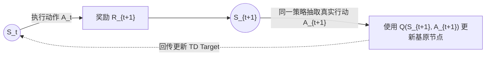
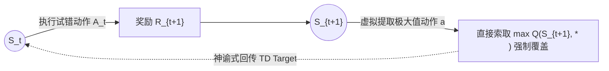

本文探讨强化学习中用于时序差分控制（TD Control）的两大核心算法：**SARSA** 与 **Q-Learning**。我们将跳离单纯的公式记忆，从强化学习的**第一性原理**出发，深剖两种算法底层的物理哲学：同策略（On-policy）与异策略（Off-policy）的本质区别。

---

## 1. 理论根基与第一性原理拆解

**我们在寻找什么？**
强化学习控制任务的终极目标，是找到一张使得累积折扣回报（Return, $G$）最大化的行为价值词典：$Q(s, a)$。

**不可跨越的物理屏障：**
在无模型（Model-Free）的黑盒环境中寻找最优解，必须进行**“试错探索”（Exploration）**。但伴随而来的问题是，探索阶段产生的不可预计的随机行为（如坠入悬崖等劣解），必然会拉低当前对预期总价值 $Q(s, a)$ 的评估。

为了解决这一矛盾，学术界衍生出了两种截然不同的哲学流派：
1. **SARSA (同策略 On-policy / 务实派)**：既然无法在物理上避免试错产生的偏离事件，我们便**正视随机性的存在**，将“试错”带来的下限风险如实计算入价值评估的预期分布中。
2. **Q-Learning (异策略 Off-policy / 理论极值派)**：在此假设下，主控身体的行为策略（Behavior Policy，负责摸索乱逛）与脑海中维护的目标评分策略（Target Policy，负责计算真正路径极值）被**完全解耦分离**。智能体能在承担严重试错代价的同时，理论规划出一条不含随机杂音的纯粹最优解。

---

## 2. SARSA 算法：基于期望方程的同策略博弈

### 2.1 数学公式与理论依据
SARSA 源起于 **Bellman 期望方程 (Expectation Equation)**的采样化推导。其要求必须顺延智能体在这个马尔可夫宇宙中**真实的游荡轨迹**来进行价值映射。

时序差分更新公式如下：
$$ Q(S_t, A_t) \leftarrow Q(S_t, A_t) + \alpha \Big[ R_{t+1} + \gamma Q(S_{t+1}, A_{t+1}) - Q(S_t, A_t) \Big] $$

- **核心区分面**：公式中实际采样的 $A_{t+1}$。
- **数学本质**：当处于 $S_t$ 时，算法不仅提取眼前奖励 $R_{t+1}$，更调用了**智能体真实计划在下一步执行的抽样动作** $A_{t+1}$，以此建立接下来的预期价值锚点。

### 2.2 SARSA 命名的由来探层
公式背后的递推更新时序，恰巧拼写成为了 **S-A-R-S-A**：
- `S`：当前状态 $S_t$
- `A`：当前依据策略采样的动作 $A_t$
- `R`：执行后由环境返还的奖励 $R_{t+1}$
- `S`：转移达到的新一轮状态 $S_{t+1}$
- `A`：在 $S_{t+1}$ 基于**同一策略**再次采样的下一发真实预判动作 $A_{t+1}$

如果在 $\epsilon$-greedy 探索周期内，“随机胡进”一旦被触发生成了 $A_{t+1}$，SARSA 将强行承担这种不良抉择导致的低评分回传，这就构成了其 **On-policy (同策略)** 绝不向神仙理想状态妥协的内核。

---

## 3. Q-Learning 算法：基于最优方程的异策略规划

### 3.1 数学公式与理论依据
Q-Learning 则承袭了 **Bellman 最优方程 (Optimality Equation)**的血脉。

其时序差分更新公式定义为：
$$ Q(S_t, A_t) \leftarrow Q(S_t, A_t) + \alpha \Big[ R_{t+1} + \gamma \max_{a} Q(S_{t+1}, a) - Q(S_t, A_t) \Big] $$

- **核心区分面**：全局绝对收敛算子 $\max_{a}$。
- **数学本质**：不论现实（Behavior Policy）中智能体准备执行什么糟糕抉择，在内部账本对其进行价值预估（Target Policy更新）时，**引擎始终假设未来的每一步都立于绝对绝对的最优状态之上**。

由于生成轨迹的行为策略（带有探索随机性）和估值更新的靶向策略（绝对贪心 $\max$）不再是同一种体系，由此便定义了其纯粹的 **Off-policy (异策略)** 体质。

---

## 4. 一个最小微观量化示例

为了更透彻地展示，设定一极简化情境：
- 当前估价：`Q(s, a) = 1.0`
- 即时奖励：`r = 2.0`
- 各超参数：$\gamma = 0.9, \alpha = 0.5$
  
在顺利移交至后继状态 $s'$ 后查阅 Q 矩阵得知：`Q(s', left) = 3.0`，`Q(s', right) = 5.0`。

若因 $\epsilon$-greedy 探索，本次随机生成真实执行项为 `left`：
**在 SARSA 的准则中：**
必须使用真实触碰的后续路径估值：
$$ V_{target} = 2.0 + 0.9 \times 3.0 = 4.7 $$
$$ Q(s,a) = 1.0 + 0.5 \times(4.7 - 1.0) = 2.85 $$

**在 Q-Learning 的准则中：**
它果断无视并抛弃了真实采样的劣路，径直抽取该状态可能存在的最大最优预估值：
$$ V_{target} = 2.0 + 0.9 \times \max(3.0, 5.0) = 6.5 $$
$$ Q(s,a) = 1.0 + 0.5 \times(6.5 - 1.0) = 3.75 $$

可以看到，Q-Learning 在面对现实挫折时展现出了无比激进的抗干扰乐观力，而 SARSA 则反映了受制于现行能力的保守评价。

---

## 5. 经典环境评价：深渊边缘的抉择 (CliffWalking)

对于带有绝命后果（如极其危险悬崖阵列）的 CliffWalking 测试域，两者表现大相径庭。

- **SARSA（求稳幸存者）**：因为它的推演中涵盖了 $10\%$ 时将滑入深渊的 $\epsilon$ 探索事故概率，故悬崖边路径评估预期会被致命惩罚项拉爆。最终将学出一条**宁愿花大量步数绕高远路、却保证拥有绝对存活概率的安全底线方案**。
- **Q-Learning（刀尖舞者）**：既然其理论评估中的靶心始终锁死 $\max$ 无伤通关预期，使得掉下悬崖的代价无法穿透回传。因此无论训练阶段因此死了几万次，它依然会固执地描绘出一条**时刻紧贴悬崖走钢丝般的纯粹极短空间直线路径**。

### 工程环境适配抉择：第一性原理的落脚
- **何时选 SARSA？** 当我们控制真实世界物理资产（诸如自动驾驶无人机、昂贵机械臂集群）时。高昂得容不下一丝试错导致毁灭的物理沉没成本，极其需要 SARSA 能够考量随机误差造成的系统破坏。
- **何时选 Q-Learning？** 若应用层存在于能够以极低虚拟成本大规模全量重启的仿真引擎系统之中。我们全然不在乎模拟世界的死亡迭代，只期望在试错终结后直接摘取那个理论极致速通最优策略字典。

---

## 6. 一句话结语精炼

如果只用一句话凝练今天探讨控制算法的双生对立，即：

- `SARSA`：汲取了系统**真实发生（含错判）**的动态动作予以更新，是为务实的 **On-policy（同策略）**。
- `Q-Learning`：跨越现实的动作执行采样，直接汲取理想最优解动作状态予以覆盖，是为理论极限的 **Off-policy（异策略）**。
