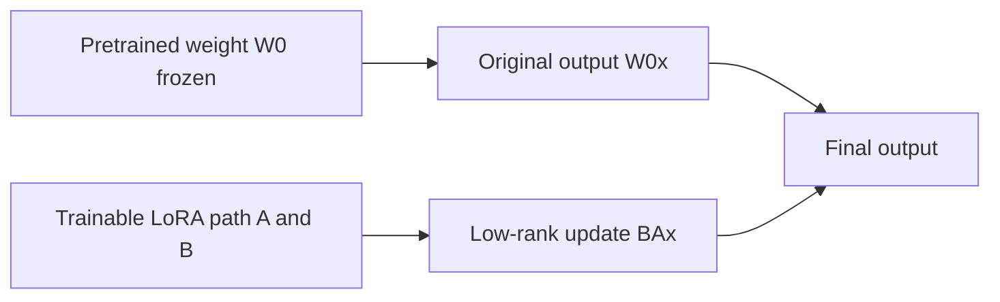

这篇补上参数高效微调的工程基础，说明 LoRA 为什么特别适合大模型和机器人任务的快速适配。

<!-- more -->


# 低秩自适应（LoRA）：大型语言模型的高效微调范式

LoRA（Low-Rank Adaptation）的核心思想是：**冻结大模型原始权重，只训练一小组低秩增量矩阵，用很少的参数近似完成任务适配**。

它解决的问题不是“如何让模型从零学会新知识”，而是“在基础模型已经很强的前提下，如何用低成本把它推向某个具体任务、风格或数据分布”。



## 1. 为什么需要 LoRA

随着预训练模型规模增长，全量微调变得越来越昂贵。

以一个 70B 参数模型为例，全量微调不只是保存 70B 个参数本身，还要保存：

- 参数梯度。
- Adam 的一阶动量。
- Adam 的二阶方差。
- 激活值和中间缓存。

因此，训练显存通常远高于模型权重本身。对普通实验室或单卡/多卡开发环境来说，全量微调往往不是最优选择。

LoRA 的目标是降低三类成本：

| 成本 | 全量微调 | LoRA |
|---|---|---|
| 可训练参数 | 更新全部权重 | 只更新少量低秩矩阵 |
| 优化器状态 | 为全部权重维护 | 只为 LoRA 参数维护 |
| 模型存储 | 每个任务一份完整模型 | 一个基础模型 + 多个小 adapter |

> [!note] 一句话理解
> 全量微调是在“重写整本书”，LoRA 更像是在关键页面贴少量修订条。

## 2. 核心假设：任务更新是低秩的

LoRA 的理论直觉来自内在维度假设（Intrinsic Dimension Hypothesis）。

大模型在预训练阶段已经学到了丰富的通用表示。对于很多下游任务，模型不需要彻底重构所有参数，只需要在原有表示空间中做一个相对低维的调整。

如果原始权重是：

$$
W_0
$$

全量微调会直接学习一个同形状的更新量：

$$
W = W_0 + \Delta W
$$

LoRA 的关键判断是：对具体任务而言，$\Delta W$ 往往可以用低秩矩阵近似，不需要是满秩矩阵。

## 3. 数学形式

假设某个线性层的原始权重为：

$$
W_0 \in \mathbb{R}^{d \times k}
$$

其中：

- $k$ 是输入维度。
- $d$ 是输出维度。

全量微调需要学习：

$$
\Delta W \in \mathbb{R}^{d \times k}
$$

LoRA 不直接训练完整的 $\Delta W$，而是把它拆成两个小矩阵：

$$
\Delta W = BA
$$

其中：

- $A \in \mathbb{R}^{r \times k}$：降维矩阵。
- $B \in \mathbb{R}^{d \times r}$：升维矩阵。
- $r$ 是 LoRA rank，且 $r \ll \min(d, k)$。

前向传播从：

$$
h = W_0x
$$

变成：

$$
h = W_0x + \frac{\alpha}{r}BAx
$$

其中 $\alpha$ 是缩放系数。$\frac{\alpha}{r}$ 用来控制 LoRA 分支的输出幅度，避免改动 rank 后输出尺度大幅变化。

## 4. 工程实现细节

LoRA 训练时通常遵循下面的策略：

1. 冻结原始权重 `W0`。
2. 新增两个可训练矩阵 `A` 和 `B`。
3. `A` 随机初始化。
4. `B` 初始化为零矩阵。
5. 只把 `A` 和 `B` 加入优化器。

为什么 `B` 要初始化为零？

因为训练开始时：

$$
BA = 0
$$

所以模型初始输出仍然等价于原始预训练模型。LoRA 分支不会在第 0 步突然破坏基础模型的输出分布，训练会更平滑。

## 5. 例子一：参数量计算

假设 Transformer 中某个 attention projection 矩阵是：

$$
W_0 \in \mathbb{R}^{4096 \times 4096}
$$

### 全量微调

需要训练的参数量是：

$$
4096 \times 4096 = 16,777,216
$$

约 1677 万参数。

### LoRA 微调

设 LoRA rank：

$$
r = 8
$$

则：

$$
A \in \mathbb{R}^{8 \times 4096}
$$

参数量：

$$
8 \times 4096 = 32,768
$$

而：

$$
B \in \mathbb{R}^{4096 \times 8}
$$

参数量同样是：

$$
4096 \times 8 = 32,768
$$

总可训练参数量：

$$
32,768 + 32,768 = 65,536
$$

比例为：

$$
\frac{65,536}{16,777,216} \approx 0.39\%
$$

也就是说，同一个线性层里，LoRA 只训练不到 0.4% 的参数。

## 6. 例子二：一个线性层的 LoRA 写法

下面是一个简化版 PyTorch 线性层 LoRA。真实工程会封装得更复杂，但核心逻辑就是这几行。

```python
import torch
import torch.nn as nn


class LoRALinear(nn.Module):
    def __init__(self, in_features, out_features, rank=8, alpha=16):
        super().__init__()
        self.weight = nn.Parameter(torch.empty(out_features, in_features))
        self.weight.requires_grad = False

        self.lora_a = nn.Parameter(torch.randn(rank, in_features) * 0.01)
        self.lora_b = nn.Parameter(torch.zeros(out_features, rank))
        self.scale = alpha / rank

    def forward(self, x):
        base = x @ self.weight.T
        update = (x @ self.lora_a.T) @ self.lora_b.T
        return base + self.scale * update
```

对应数学关系是：

```text
base   = W0 x
update = B A x
output = W0 x + scale * B A x
```

实际训练时，优化器只需要接收 `lora_a` 和 `lora_b`。

## 7. 例子三：不同任务使用不同 LoRA adapter

LoRA 的一个工程优势是：可以共享同一个基础模型，为不同任务保存不同 adapter。

```text
base model
  + medical_lora_adapter
  + legal_lora_adapter
  + code_lora_adapter
  + robot_lora_adapter
```

例如：

- 医疗问答：训练一个医疗 LoRA，只保存几十 MB 到几百 MB 的 adapter。
- 法律文书：训练一个法律 LoRA，部署时切换 adapter。
- 代码补全：训练一个代码 LoRA，不需要复制完整基础模型。
- 机器人策略：在 VLA 模型上训练某个机械臂任务的 LoRA，让模型适配新的动作空间或视觉场景。

这比“每个任务保存一份完整模型”更适合多任务部署和快速实验。

## 8. 例子四：VLA / 机器人场景中的 LoRA

在 VLA 或机器人策略模型中，LoRA 常见用法不是让模型从零学会机器人控制，而是让已有模型适配新环境。

典型场景：

1. 基础模型已经学过通用视觉-语言-动作对齐。
2. 新任务只有少量真实机器人数据。
3. 不希望全量更新视觉编码器、语言模型或 action head。
4. 在关键线性层上插入 LoRA，只训练 adapter。

例如，一个机器人模型原本能理解：

```text
pick up the red block
```

现在要适配一个新的实验台、相机角度和末端执行器。可以冻结原模型，只在以下模块上加 LoRA：

- 视觉投影层。
- cross-attention 或 self-attention 的 `q_proj`、`v_proj`。
- action projection / action head。

训练数据可以是：

```text
图像 observation + 语言指令 + 真实动作轨迹
```

LoRA 学到的是“这个新环境下应该如何轻微调整原模型的内部表示和动作输出”，而不是重新学习整个机器人策略。

## 9. 推理阶段如何合并

训练完成后，可以保留 LoRA 分支，也可以把它合并进原始权重：

$$
W_{deploy} = W_0 + \frac{\alpha}{r}BA
$$

合并后，推理时只需要一次普通线性层计算，不再额外计算 LoRA 分支。

这就是常说的 **zero inference latency**：LoRA 在合并后不会增加推理延迟。

不过，如果部署时需要动态切换多个 adapter，就可能选择不合并，而是在运行时加载不同 LoRA。

## 10. 常见超参数怎么选

| 超参数 | 含义 | 常见选择 |
|---|---|---|
| `r` | 低秩矩阵 rank | 4、8、16、32 |
| `alpha` | LoRA 缩放系数 | 常设为 `r` 的 1-4 倍 |
| `dropout` | LoRA 分支 dropout | 小数据集可用 0.05-0.1 |
| target modules | 插入 LoRA 的模块 | 常见为 `q_proj`、`v_proj`、`k_proj`、`o_proj`、MLP projection |

经验上：

- 数据少、任务简单：可以从 `r=4` 或 `r=8` 开始。
- 任务复杂、风格变化明显：可以尝试 `r=16` 或 `r=32`。
- attention 相关任务：优先尝试 `q_proj` 和 `v_proj`。
- 生成风格或领域知识适配：可以同时覆盖 attention 和 MLP projection。

## 11. LoRA 的优点与限制

优点：

- 显著减少可训练参数。
- 降低显存和优化器状态开销。
- 每个任务只需保存小 adapter。
- 可以在推理前合并权重，不增加延迟。
- 适合快速实验、领域适配和多任务部署。

限制：

- LoRA 不是万能压缩术，基础模型能力太弱时效果有限。
- rank 太小可能表达能力不足。
- 插入模块选错时，参数省了但效果也会明显下降。
- 如果任务需要大幅改变模型行为，LoRA 可能不如全量微调。
- 多 adapter 组合时可能出现干扰，需要额外评估。

## 12. 总结

LoRA 可以理解为一种“低成本任务适配层”：

```text
冻结原模型 W0
  -> 训练低秩更新 BA
  -> 用很少参数近似 ΔW
  -> 部署时可合并回原权重
```

它的关键不是简单“少训练参数”，而是利用了一个重要事实：**很多下游任务所需的权重更新并不需要占满整个高维参数空间，而可以被低秩子空间有效表示**。

在大模型、VLA 和机器人策略适配中，LoRA 的价值尤其明显：它让“保留强基础模型能力 + 快速适配新任务”变成一个工程上可承受的方案。
