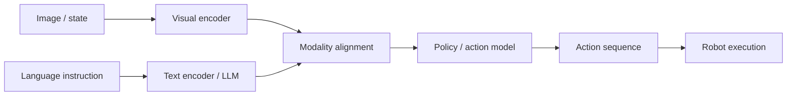

这篇把 Projector、FiLM、动作分块、Diffusion Policy 和 Flow Matching 放在一条链路里，解释模态如何对齐、动作如何生成。

<!-- more -->


# 模态对齐与连续动作预测

具身智能的核心难题是：**物理世界是连续、高维、多模态的，而模型内部只能处理张量、token 和概率分布**。

因此，VLA / 机器人策略模型通常要解决两类映射问题：

1. **模态对齐**：让图像、语言、状态等异构信息进入同一个可计算空间。
2. **动作预测**：把模型表示转换成可执行的连续动作或动作序列。



## 1. 模态对齐到底在对齐什么

图像和语言不是天然兼容的。

视觉编码器输出的是连续特征，例如：

```text
patch_1: [0.12, -0.08, ...]
patch_2: [0.31,  0.44, ...]
```

语言模型处理的是 token embedding，例如：

```text
"pick"  -> embedding
"red"   -> embedding
"block" -> embedding
```

模态对齐的目标就是让模型能把视觉特征解释成语言或动作相关的语义：

```text
视觉 patch
  -> object / relation / affordance
  -> language-conditioned representation
  -> action decision
```

在工程上，常见对齐方式主要有两类：

- **Projector**：把视觉特征投影到语言模型 embedding 空间。
- **FiLM**：用语言特征直接调制视觉编码过程。

## 2. Projector：把视觉 token 接到语言模型

Projector 常见于 VLM / VLA 架构，例如 LLaVA、OpenVLA 这类模型。它的作用是把视觉编码器输出转换成 LLM 能接收的 embedding。

设视觉编码器输出：

$$
Z_v \in \mathbb{R}^{N \times D_v}
$$

其中 $N$ 是 patch 数量，$D_v$ 是视觉特征维度。LLM 需要的 embedding 维度是 $D_l$。Projector 的目标是：

$$
Z_{align} \in \mathbb{R}^{N \times D_l}
$$

常见 MLP projector 形式为：

$$
Z_{align} = W_2 \sigma(W_1 Z_v + b_1) + b_2
$$

其中 $\sigma$ 通常是 GELU 或 SiLU。

### 2.1 例子：LLaVA 式图文对齐

假设用户输入：

```text
What is the person holding?
```

模型处理流程可以理解为：

```text
image
  -> ViT / CLIP vision encoder
  -> visual patch features
  -> MLP projector
  -> visual tokens in LLM embedding space
  -> LLM attends to text + visual tokens
  -> answer
```

Projector 的关键不是简单“改维度”，而是让视觉 patch 在 LLM 的 token 空间中变成可被注意力机制读取的“视觉词”。

### 2.2 例子：OpenVLA 式动作生成

在 VLA 中，Projector 还承担把视觉信息接入语言模型动作解码链路的任务。

例如指令是：

```text
put the yellow cup on the plate
```

视觉特征经过 projector 后，LLM 可以把图像 token、语言 token 和动作 token 放在同一个上下文中推理：

```text
[visual tokens] + [instruction tokens] -> [action tokens]
```

这类方法的优点是复用 LLM 的强语义推理能力；缺点是动作输出往往需要额外的 action tokenizer 或 action head。

## 3. FiLM：用语言调制视觉特征

FiLM（Feature-wise Linear Modulation）不是把视觉特征送进语言空间，而是用语言条件直接改变视觉编码器内部的特征响应。

假设视觉特征图为：

$$
F \in \mathbb{R}^{C \times H \times W}
$$

语言指令 embedding 为：

$$
E_l
$$

FiLM 从语言 embedding 中生成每个通道的缩放和偏移：

$$
\gamma = f_\gamma(E_l), \quad \beta = f_\beta(E_l)
$$

然后调制视觉特征：

$$
F'_{c,h,w} = \gamma_c F_{c,h,w} + \beta_c
$$

### 3.1 例子：RT-1 中的语言条件化视觉编码

在 RT-1 中，语言指令不会直接作为字符串进入模型。通常先用 Universal Sentence Encoder 得到：

```text
natural_language_embedding: float32[512]
```

然后这个 embedding 作为 FiLM context 进入视觉编码器。

如果指令是：

```text
pick up the red block
```

FiLM 的直观作用是：

- 增强与“红色”“方块”“可抓取物体”相关的视觉通道。
- 抑制与背景、无关物体、桌面纹理相关的通道。
- 让后续 image tokens 更偏向当前任务，而不是泛泛描述整张图。

### 3.2 Projector 和 FiLM 的差异

| 对比项 | Projector | FiLM |
|---|---|---|
| 作用位置 | 视觉编码器之后 | 视觉编码器内部 |
| 核心目标 | 把视觉 token 接入语言空间 | 用语言条件调制视觉特征 |
| 常见模型 | LLaVA、OpenVLA | RT-1、语言条件化 CNN/ViT |
| 优点 | 易接入 LLM，适合语义推理 | 对任务相关视觉特征更直接 |
| 风险 | 视觉 token 可能被 LLM 当作陌生 token | 过强调制可能压掉有用视觉信息 |

一句话区分：**Projector 是“把图像翻译给语言模型听”，FiLM 是“让图像编码器按语言指令去看”。**

## 4. ACT：用动作分块降低控制抖动

ACT（Action Chunking with Transformers）的核心思想是：**不要只预测下一步动作，而是一次预测未来一段动作序列**。

在机械臂控制中，如果模型每次只预测 $t+1$ 的动作，观测噪声会导致输出抖动。ACT 通过动作分块和时间集成让轨迹更平滑。

### 4.1 动作分块

在 $t$ 时刻，模型直接预测未来 $k$ 步动作：

$$
A_t = [a_t, a_{t+1}, a_{t+2}, \dots, a_{t+k-1}]
$$

例如 $k=4$ 时：

```text
t=10 预测: [a10, a11, a12, a13]
t=11 预测: [a11, a12, a13, a14]
t=12 预测: [a12, a13, a14, a15]
```

同一个动作时刻会被多次预测。ACT 利用这种重叠来做平滑。

### 4.2 时间集成

最终执行的 $a_t$ 不是单次预测，而是多个历史预测的加权平均：

$$
a_t^{final} =
\frac{1}{\sum_{i=0}^{k-1} w_i}
\sum_{i=0}^{k-1} w_i \hat{a}_t^{(t-i)}
$$

其中常见权重为：

$$
w_i = e^{-i/\tau}
$$

越新的预测权重越大。

### 4.3 例子：机械臂末端位置平滑

假设模型连续三次都预测了时刻 `t=12` 的末端位置：

| 来源 | 对 `a12` 的预测 |
|---|---|
| `t=10` 的 chunk | `[0.50, 0.21, 0.30]` |
| `t=11` 的 chunk | `[0.52, 0.20, 0.31]` |
| `t=12` 的 chunk | `[0.49, 0.22, 0.29]` |

直接使用最新预测可能会抖动。时间集成会把多个预测合并成更稳定的动作：

```text
a12_final ≈ [0.50, 0.21, 0.30]
```

从信号处理角度看，时间集成相当于低通滤波器：它削弱高频噪声，让机械臂运动更平滑。

## 5. 连续动作预测为什么难

机器人动作不是单一正确答案，而经常是多峰分布。

例如让机械臂绕过障碍物去拿杯子：

```text
方案 A：从左边绕过去
方案 B：从右边绕过去
```

两条轨迹都正确。如果使用普通 MSE / L2 回归，模型可能学到两条路径的平均值，而平均路径刚好撞上障碍物。

这就是连续动作预测中的“均值回归”问题。

生成式策略的价值在于：它不是只预测一个平均动作，而是建模动作轨迹的分布。

## 6. Diffusion Policy：从噪声生成动作轨迹

Diffusion Policy 把动作序列看作一个数据分布，通过逐步去噪生成轨迹。

### 6.1 基本流程

训练时：

```text
真实动作轨迹 x0
  -> 加噪
  -> xt
  -> 网络预测噪声
  -> 学会如何去噪
```

推理时：

```text
随机噪声 xT
  -> 多步去噪
  -> 动作轨迹 x0
```

在条件策略中，去噪网络还会接收环境条件：

```text
observation / language / visual features
```

对应可写成：

$$
\epsilon_\theta(x_t, t, c)
$$

其中 $c$ 是条件信息。

### 6.2 例子：多峰抓取轨迹

如果桌上有障碍物，正确轨迹可能有两种：

- 从左侧绕开。
- 从右侧绕开。

Diffusion Policy 可以从噪声中采样出其中一种合理轨迹，而不是输出两种轨迹的平均值。

优点：

- 能建模多峰动作分布。
- 适合生成连续、复杂的动作轨迹。
- 对高维动作序列表达力强。

限制：

- 推理通常需要多步采样。
- 控制频率可能受采样步数限制。
- 对实时机器人控制来说，延迟是关键问题。

## 7. Flow Matching：直接学习从噪声到动作的流

Flow Matching 也建模从噪声分布到数据分布的生成过程，但它不要求网络逐步预测噪声，而是学习一个向量场。

直观理解：

```text
Diffusion: 每一步判断当前噪声该去掉多少
Flow Matching: 学一个方向场，告诉样本应该往哪里流
```

在一种常见设定中，噪声 $x_0$ 和真实动作 $x_1$ 之间的路径被定义为：

$$
x_t = (1 - t)x_0 + tx_1
$$

这个路径的速度是：

$$
x_1 - x_0
$$

训练目标是让模型预测这个速度场：

$$
\mathcal{L}_{FM} =
\mathbb{E}_{t,x_0,x_1}
\left\|
v_\theta(x_t,t,c) - (x_1 - x_0)
\right\|^2
$$

### 7.1 为什么可能更快

Diffusion 的生成路径通常更弯，需要较多步数逐渐去噪。Flow Matching 倾向于学习更直接的概率流路径，因此推理时可以用更少 ODE 步数到达动作分布。

对机器人控制来说，这意味着：

- 更低延迟。
- 更高控制频率。
- 更适合在线闭环执行。

### 7.2 Diffusion Policy 与 Flow Matching 对比

| 对比项 | Diffusion Policy | Flow Matching |
|---|---|---|
| 学习目标 | 预测噪声或 score | 预测向量场 |
| 生成方式 | 多步去噪 | 沿概率流积分 |
| 推理步数 | 通常较多 | 可更少 |
| 优点 | 成熟、稳定、表达强 | 速度潜力更高 |
| 风险 | 实时性压力大 | 工程和训练细节更敏感 |

## 8. 一条完整 VLA 动作链路

可以把前面的技术串成一条实际链路：

```text
语言指令: "pick up the red block"
  -> text encoder / LLM embedding
图像 observation
  -> visual encoder
语言 + 图像
  -> Projector 或 FiLM 做模态对齐
对齐后的表示
  -> action model
  -> ACT / Diffusion / Flow Matching 生成动作序列
  -> robot 执行
```

不同模型会在这条链路中选择不同设计：

- RT-1 更强调语言 FiLM 条件化视觉特征，再预测离散动作 token。
- OpenVLA 更强调把视觉 token 接入语言模型，再让语言模型产生动作 token。
- ACT 更强调动作 chunk 和时间集成，让控制输出平滑。
- Diffusion Policy / Flow Matching 更强调连续动作分布建模，避免均值回归。

## 9. 技术选择建议

| 目标 | 更适合的技术 |
|---|---|
| 图像接入 LLM 语义推理 | Projector |
| 语言直接影响视觉特征提取 | FiLM |
| 提高机械臂动作平滑度 | ACT / temporal ensembling |
| 复杂连续轨迹、多峰动作分布 | Diffusion Policy |
| 高控制频率、低采样延迟 | Flow Matching |

## 10. 总结

模态对齐和动作预测其实是在解决同一个问题的两端：

```text
世界输入如何进入模型
  -> 模态对齐

模型表示如何变成动作
  -> 连续动作预测
```

Projector 和 FiLM 解决“图像、语言如何互相理解”；ACT、Diffusion Policy 和 Flow Matching 解决“模型如何稳定地产生机器人动作”。

一句话总结：**VLA 的关键不是单纯把视觉、语言和动作堆在一起，而是把它们放进同一个可学习、可控制、可执行的表示链路里。**
