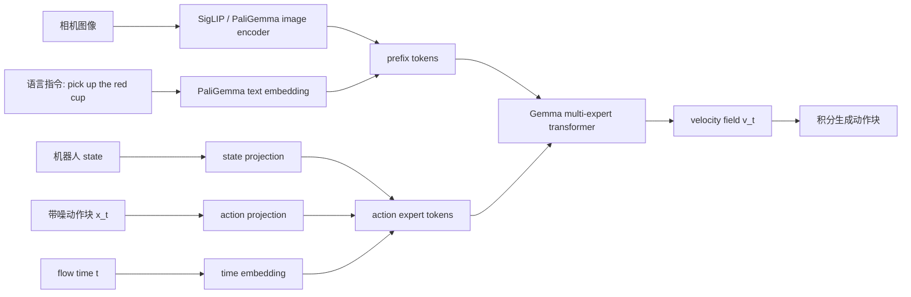

这篇进一步拆解 π0 的输入、训练目标和推理流程，解释它为什么更适合连续动作生成。

<!-- more -->


# π0如何把VLM变成VLA：从代码和第一性原理理解

π0 的信息流:




## 1. 第一性原理：VLM 和 VLA 到底差在哪里

普通 VLM 学的是：

```text
p(text tokens | image, text)
```

也就是给定图像和文本上下文，预测后续文本 token。

机器人策略模型真正需要学的是：

```text
p(A | o)
```

其中：

```text
o = 图像 + 语言指令 + 机器人本体状态
A = 未来一段连续动作
```

所以 VLM 变成 VLA 的核心不是“多输出几个 token”，而是把模型的目标从“语言生成”换成“条件动作分布建模”。

π0 的答案是：

```text
PaliGemma 负责看懂世界和语言
Action expert 负责生成连续动作
Flow matching 负责把动作分布学出来
```

## 2. 代码里的整体结构

在 openpi 中，π0 的默认配置位于：

```text
0_Reference/code repos/openpi/src/openpi/models/pi0_config.py
```

关键配置是：

```python
paligemma_variant = "gemma_2b"
action_expert_variant = "gemma_300m"
action_dim = 32
action_horizon = 50
```

含义是：

- `gemma_2b`：继承 PaliGemma 的视觉语言主干，用来处理图像和语言。
- `gemma_300m`：新增动作专家，用来处理机器人状态、带噪动作和 flow matching 时间步。
- `action_dim = 32`：动作向量被 padding 到 32 维。
- `action_horizon = 50`：模型一次生成未来 50 步动作。

在 `pi0.py` 中，初始化时把两个 expert 放进同一个 Gemma 模块：

```python
llm = _gemma.Module(
    configs=[paligemma_config, action_expert_config],
    embed_dtype=config.dtype,
    adarms=config.pi05,
)
```

这意味着 π0 不是只有一个普通 LLM，而是有两套 transformer 权重：

```text
expert 0: PaliGemma / VLM expert
expert 1: action expert
```

在 `gemma.py` 的 `_name()` 函数中可以看到设计意图：

```python
if i == 0:
    return name
return f"{name}_{i}"
```

第一套权重不加后缀，可以直接加载 PaliGemma checkpoint。第二套权重带 `_1` 后缀，从头训练，作为动作专家。

## 3. 输入如何进入模型

π0 的输入结构在 `model.py` 的 `Observation` 中定义：

```python
images: dict[str, ...]
state: float
tokenized_prompt: int
tokenized_prompt_mask: bool
```

也就是：

```text
多路相机图像
机器人本体状态
语言指令 token
```

### 3.1 prefix：图像和语言

`pi0.py` 的 `embed_prefix()` 负责处理图像和语言。

图像先经过 PaliGemma 的视觉编码器：

```python
image_tokens, _ = self.PaliGemma.img(obs.images[name], train=False)
```

语言指令经过 PaliGemma 的文本 embedding：

```python
tokenized_inputs = self.PaliGemma.llm(obs.tokenized_prompt, method="embed")
```

这些 token 组成 prefix：

```text
prefix = image tokens + language tokens
```

它们表示模型对当前场景和任务的理解。

### 3.2 suffix：状态、带噪动作和时间

`embed_suffix()` 负责处理机器人控制相关的信息。

机器人状态被投影成一个 token：

```python
state_token = self.state_proj(obs.state)[:, None, :]
```

带噪动作块被投影成 action expert token：

```python
action_tokens = self.action_in_proj(noisy_actions)
```

flow matching 的时间步 `t` 也会被编码进去：

```python
time_emb = posemb_sincos(timestep, ...)
```

于是 suffix 大概是：

```text
suffix = state token + noisy action tokens + time embedding
```

## 4. 一个具体例子：pick up the red cup

假设当前任务是：

```text
prompt = "pick up the red cup"
```

机器人输入有：

```text
base_0_rgb: 正面相机图像
left_wrist_0_rgb: 左腕相机图像
right_wrist_0_rgb: 右腕相机图像
state: 当前关节角、夹爪状态等
```

π0 的信息流可以理解为：


PaliGemma 的作用是理解：

```text
红杯子在哪里
pick up 需要抓取
当前画面中哪些区域和任务相关
```

action expert 的作用是生成：

```text
未来 50 步机械臂和夹爪应该怎么动
```

## 5. 训练目标：不是预测动作，而是预测向量场

π0 的训练逻辑在 `compute_loss()` 中。

给定真实动作块：

```python
actions
```

代码先采样随机噪声：

```python
noise = jax.random.normal(noise_rng, actions.shape)
```

再采样一个时间：

```python
time = jax.random.beta(time_rng, 1.5, 1, batch_shape) * 0.999 + 0.001
```

然后构造带噪中间动作：

```python
x_t = time * noise + (1 - time) * actions
```

如果 `time = 0`，那么：

```text
x_t = actions
```

如果 `time = 1`，那么：

```text
x_t = noise
```

目标向量场是：

```python
u_t = noise - actions
```

模型预测：

```python
v_t = self.action_out_proj(...)
```

loss 是：

```python
mean(square(v_t - u_t))
```

这就是 flow matching：模型不是直接背答案，而是学习“在任意噪声程度下，动作点应该往哪个方向流动”。

## 6. 推理过程：从噪声流到动作

推理逻辑在 `sample_actions()` 中。

第一步，从纯噪声动作块开始：

```python
noise = jax.random.normal(rng, (batch_size, action_horizon, action_dim))
```

第二步，先计算并缓存 prefix：

```python
_, kv_cache = self.PaliGemma.llm([prefix_tokens, None], ...)
```

这样图像和语言只需要算一次。

第三步，从 `time = 1` 往 `time = 0` 积分：

```python
v_t = self.action_out_proj(...)
x_t = x_t + dt * v_t
```

代码里 `dt` 是负数：

```python
dt = -1.0 / num_steps
```

所以实际过程是：

```text
纯噪声动作块
  -> 稍微像动作
  -> 更像动作
  -> 可执行动作块
```

最终输出：

```text
actions: [50, 32]
```

也就是未来 50 步连续控制量。

## 7. 为什么不直接让 VLM 输出动作 token

从第一性原理看，机器人动作有几个特点：

- 连续，不是天然离散 token。
- 高频，控制频率可以到几十 Hz。
- 多模态，同一个任务可能有多种可行轨迹。
- 对小误差敏感，文本 token 级别的粗粒度表达不够。

如果强行让 VLM 自回归输出离散动作 token，会遇到两个问题：

1. 长动作序列生成慢。
2. 离散化会损失连续控制精度。

π0 用 action chunking 和 flow matching 避开了这个问题：

```text
一次生成一整段动作
动作保持连续值
通过向量场建模多模态动作分布
```

## 8. 总结：π0 如何把 VLM 变成 VLA

可以把 π0 的转化过程压缩成这张表：

| 层面 | VLM | π0 / VLA |
|---|---|---|
| 输入 | 图像、文本 | 图像、文本、机器人状态 |
| 主干 | PaliGemma | PaliGemma + action expert |
| 输出 | 文本 token | 连续动作块 |
| 训练目标 | 语言建模 | 条件流匹配 |
| 推理方式 | 自回归生成文本 | 从噪声积分生成动作 |
| 能力目标 | 视觉语言理解 | 语言条件下的机器人控制 |

一句话：

```text
π0 保留 VLM 的语义理解能力，把动作生成交给一个独立的连续动作专家，并用 flow matching 学习从观察到动作块的条件分布。
```

这就是从 VLM 到 VLA 的关键：不是把动作伪装成语言，而是让语言视觉模型成为动作分布模型的条件理解器。
