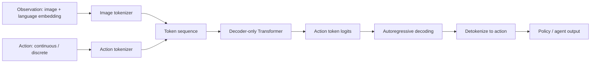

这篇从代码结构入手，拆解 RT-1 如何把视觉、语言和动作统一成一个自回归序列建模问题。

<!-- more -->


# RT-1 整体结构

RT-1 的核心思想是：**把机器人控制改写成带结构的自回归序列预测问题**。

它不直接从图像回归连续动作，而是把视觉、语言和动作都组织成 token 序列，再用 Transformer 预测动作 token，最后 detokenize 回真实动作。



在代码层面，两个主文件的职责可以分开看：

- `transformer_network.py`：定义模型本体，负责图像 token 化、动作 token 化、序列拼接、Transformer 前向、loss 计算和推理解码。
- `sequence_agent.py`：把模型接入 TF-Agents，负责 policy 包装、训练数据转换、loss 调用、梯度更新和训练流程。

## 1. TransformerNetwork：模型本体

`TransformerNetwork` 不是一个单纯的 Transformer，而是一个 actor network。它把感知、语言条件、动作和时间上下文统一组织成 Transformer 能处理的序列。

初始化阶段主要创建：

1. decoder-only Transformer。
2. 图像 tokenizer，即 FiLM EfficientNet + TokenLearner。
3. 动作 tokenizer，用于把动作离散成 token。
4. attention mask 和 action loss mask。
5. 动作 token embedding 层和输出 logits 层。

### 1.1 图像如何进入模型

图像不会直接送入 Transformer，而是先变成视觉 token。

流程大致是：

1. 从 `observations["image"]` 取出图像。
2. 根据 `outer_rank` 判断当前是训练还是推理。
3. 训练时图像形状通常是 `[B, T, H, W, C]`；推理时会补出时间维。
4. 做 dtype 转换、crop 等预处理。
5. 调用 `RT1ImageTokenizer` 得到 `context_image_tokens`。
6. reshape 成后续可以和动作 token 拼接的形状。

关键点：Transformer 处理的是压缩后的视觉 token，不是原始像素。

### 1.2 语言如何进入模型

这个仓库里的 RT-1 **不包含“语言字符串 -> embedding”的转换代码**。

模型只消费已经算好的：

```text
natural_language_embedding: float32[512]
```

推理或训练时，需要在模型外部先用 Universal Sentence Encoder (USE) 把自然语言指令编码成 512 维向量，然后放进 observation。

```text
自然语言指令
  -> Universal Sentence Encoder
  -> 512 维 natural_language_embedding
  -> FiLM conditioning
  -> 视觉编码器产生 language-conditioned image tokens
```

在 `transformer_network.py` 中，`natural_language_embedding` 会被取出作为 `context`，传给 image tokenizer。随后它通过 FiLM conditioning 调制 EfficientNet 的视觉特征。

`natural_language_instruction` 字符串即使出现在输入 spec 里，也主要用于 summary/logging，不是模型前向计算的核心输入。

### 1.3 动作如何 token 化

RT-1 不直接回归连续动作，而是把每个动作维度离散成一个分类 token。

`action_tokenizer.py` 的处理方式：

- `int32` 动作：直接当作离散 token。
- `float` 动作：先按动作边界 clip，再归一化到 `[0, 1]`，最后映射到 `vocab_size` 个桶。

连续动作 $a$ 到离散类别 $k$ 的核心形式是：

$$
k = \left\lfloor \frac{a - min}{max - min} \cdot (V - 1) \right\rfloor
$$

其中 $V$ 是词表大小，也就是离散桶数。

这样做的意义：

- 训练目标变成分类问题，可以直接用交叉熵。
- 每个动作维度都能独立离散化成 token。
- 动作生成可以自然接入自回归序列建模。

反过来，`detokenize` 会把预测出的 token id 还原成环境可执行的动作值或 one-hot 离散动作。

### 1.4 输入序列如何拼接

每个时间步大致由两部分组成：

```text
[image tokens, action tokens]
```

多个时间步展开后，形成一个长序列：

$$
[\text{img}_{0,1}, \dots, \text{img}_{0,N},
 \text{act}_{0,1}, \dots, \text{act}_{0,M},
 \text{img}_{1,1}, \dots]
$$

代码里的核心步骤：

1. 图像通过 image tokenizer 得到 `context_image_tokens`。
2. 动作 token 先 one-hot，再经过 Dense 映射到 token embedding size。
3. 图像 token 和动作 token 在 token 维度 concat。
4. reshape 成 Transformer 需要的 `[B, sequence_length, embedding_dim]`。

需要注意：源码中有一处会把 action embedding 置零：

```python
action_tokens = tf.zeros_like(action_tokens)
```

注释里说明这是 bug workaround。因此在当前实现里，动作 token 更像是结构占位和监督目标，而不是完整的语义输入。

### 1.5 Attention mask 为什么重要

`_generate_masks` 主要生成两类 mask：

- `default_attention_mask`：保证自回归因果性，当前位置不能看到未来位置。
- `action_tokens_mask`：指定哪些位置参与动作 token 的预测和 loss。

RT-1 预测的不是普通文本，而是带时间结构的动作序列。因此 mask 的核心作用是控制：

- 当前动作能看哪些历史 observation。
- 当前动作能看哪些历史 action token。
- 未来时间步或不该监督的位置不能泄漏进预测。

这是把机器人控制改写成序列建模时最关键的结构约束之一。

## 2. 训练与推理

### 2.1 训练：teacher forcing

训练时，模型一次性接收完整序列。

大致流程：

1. `SequenceAgent` 从 experience 中取出真实 action。
2. 通过 `policy.set_actions()` 把真实动作传给 `TransformerNetwork`。
3. `TransformerNetwork` 把图像和真实动作都 token 化。
4. 拼成完整 token 序列并送入 Transformer。
5. Transformer 输出所有位置的 logits。
6. 取出动作 token 对应位置。
7. 用 `SparseCategoricalCrossentropy` 计算 token 级分类损失。
8. 对有效时间步求平均，得到最终 loss。

本质上，这是 teacher forcing：训练时把真实动作喂进去，让模型学习预测对应的动作 token。

### 2.2 推理：逐 token 自回归生成

推理时，模型不会一次性生成完整动作，而是逐 token 解码。

流程是：

1. 输入当前 observation。
2. 图像被 token 化，并用语言 embedding 做 FiLM conditioning。
3. 从 `network_state` 里读取之前已经生成的 action tokens。
4. Transformer 预测下一个动作 token。
5. 把新 token 写回 `network_state`。
6. 重复直到一个动作的所有 token 都生成完。
7. 调用 `detokenize` 得到实际动作。

所以 RT-1 的推理更像文本模型解码，只是生成对象从文字 token 换成了动作 token。

## 3. SequenceAgent：训练框架包装

`sequence_agent.py` 主要负责把 `TransformerNetwork` 接到 TF-Agents 的接口里。它本身不定义模型结构。

### 3.1 SequencePolicy

`SequencePolicy` 是对 actor network 的轻封装。

主要职责：

- `set_actions`：把真实动作传给 actor network。
- `get_actor_loss`：从 actor network 取 loss。
- `get_aux_info`：取预测 token、loss、attention 等辅助信息。
- `_action`：调用 actor network 生成动作。

也就是说，policy 不决定动作如何生成，真正的生成逻辑仍在 `TransformerNetwork`。

### 3.2 SequenceAgent

`SequenceAgent` 的职责：

1. 实例化传入的 actor network。
2. 创建 train policy 和 collect/eval policy。
3. 初始化 TF-Agents 的 `TFAgent`。
4. 创建 `DataContext` 和 `AsHalfTransition`，把经验数据转成训练需要的 transition。
5. 调用 loss，执行梯度更新。

训练入口是 `_train`：

```text
experience
  -> transition
  -> policy.set_actions(real actions)
  -> policy.action(...)
  -> actor_network.get_actor_loss()
  -> mask invalid steps
  -> apply gradients
```

梯度更新在 `_apply_gradients` 中完成，主要是对 actor network 的 `trainable_weights` 求梯度，并把 `inf` / `nan` 梯度置零后交给 optimizer。

## 4. 端到端执行路径

### 4.1 训练路径

```text
外部创建 SequenceAgent
  -> SequenceAgent 实例化 TransformerNetwork
  -> TransformerNetwork 创建 image tokenizer / action tokenizer / Transformer
  -> SequenceAgent 将 experience 转成 transition
  -> train_policy 把真实动作交给 TransformerNetwork
  -> TransformerNetwork token 化图像和动作
  -> 拼接成 Transformer 序列
  -> 输出动作 token logits
  -> 计算 token 级 loss
  -> SequenceAgent 反传更新参数
```

### 4.2 推理路径

```text
输入 observation
  -> 外部 USE 得到 natural_language_embedding
  -> TransformerNetwork token 化图像
  -> FiLM 用语言 embedding 调制视觉特征
  -> Transformer 自回归预测动作 token
  -> 写回 network_state
  -> token 生成完整后 detokenize
  -> 输出环境可执行动作
```

## 5. 关键张量速查

| 名称 | 含义 |
|---|---|
| `observations["image"]` | 图像输入 |
| `observations["natural_language_embedding"]` | 外部 USE 生成的 512 维语言 embedding |
| `context_image_tokens` | 经过语言条件化后的图像 token |
| `action_tokens` | 离散化后的动作 token |
| `input_token_sequence` | 图像 token 和动作 token 拼成的长序列 |
| `output_tokens` | Transformer 每个位置输出的 logits |
| `predicted_tokens_for_output` | 推理阶段最终预测出的动作 token |
| `output_actions` | detokenize 后的真实动作 |
| `network_state` | 推理时缓存历史图像 token、动作 token、序列位置等状态 |

## 6. 最核心的理解点

读 RT-1 代码时，最重要的是抓住下面几件事：

1. **语言先外部编码**：USE 把自然语言指令转成 512 维 `natural_language_embedding`，模型源码不负责字符串编码。
2. **视觉被语言条件化**：语言 embedding 通过 FiLM 调制 EfficientNet 视觉特征。
3. **动作被离散化**：连续控制被改写成动作 token 分类问题。
4. **多模态被拼成序列**：图像 token 和动作 token 按时间步展开后送入 Transformer。
5. **训练和推理不同**：训练用真实动作 teacher forcing，一次性算完整序列；推理逐 token 自回归生成动作。
6. **agent/network 分层**：`TransformerNetwork` 管模型计算，`SequenceAgent` 管 TF-Agents 训练流程。

一句话总结：**RT-1 把“看图像和语言指令做动作”变成了“在语言条件化视觉 token 的基础上，自回归预测离散动作 token”。**
